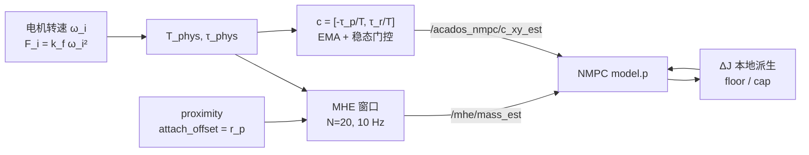

# viz 场景下 m / J / c 的全生命周期

按 `scripts/gripper/run_sitl_gripper_viz.sh` 的**当前默认档位**，逐阶段说明质量 $m$、
惯量增量 $\Delta J$、复合质心水平偏移 $c_{xy}$ 这三个量在 **MHE** 与 **NMPC** 两侧
分别怎么变、被谁写、被谁用。

阶段：**ATTACH → 巡航（LIFT + 悬停）→ 八字 → DROP → DROP 后**。

> [!abstract] 2026-09-02 的档位大改
> 本文基于 `ea899ae`。这一天默认档位发生了成组变更，与更早的批次**不可直接对比**：
> 载荷 0.3 → **0.15 kg**、包线 0.5 → **0.3 kg**、八字 $r$ 5 → **10 m**（4 m/s 工作点）、
> 抬升高度 2.5 → **6.0 m**、$\Delta J$ 棘轮默认 **关**、地板 0.15 → **0.05 kg**、
> drop **不再**给 MHE 发事件、MHE 几何释放改走 `self` + **质量域卸载判据**。
> 看旧日志时先核对参数行。

---

## 0. 档位与常数

### 0.1 关键参数

| 侧 | 参数 | 值 | 含义 |
|---|---|---|---|
| 场景 | `GRIP_PAYLOAD_KG` | **0.15** kg | 载荷真值（只用于评估对表） |
| 场景 | `GRIP_PAYLOAD_ENVELOPE` | **0.3** kg | 机架规格，**不是**包裹质量 |
| 场景 | `GRIP_ECC_Y` / `GRIP_ATTACH_TOL` | 0.10 / 0.03 m | attach 偏心上限 $r_{xy}=0.13$ |
| 场景 | `GRIP_DYN_R` / `W` / `RAMP` / `DZ` | **10.0** / 0.283 / **9.36** / 0.8 | 八字，$v_{peak}=4.0$ m/s |
| 场景 | `GRIP_Z_HIGH` / `LIFT_DUR` | **6.0** m / **8.4** s | 爬升率 0.649 m/s |
| NMPC | `use_mhe` | `true` | $m$ 只来自 MHE，attach 不注真值 |
| NMPC | `geom_source` | `online` | 几何不从 attach 真值算 |
| NMPC | `NMPC_GEOM_COUPLED` | `0` | 几何槽是 legacy $[\Delta J, c_x, c_y]$ |
| NMPC | `dj_track_mest` | `true` | 模型侧 $\Delta J$ 跟随 $m_{est}$ |
| NMPC | `dj_ratchet_enable` | **`false`** | **双向跟随**（09-02 翻转） |
| NMPC | `grip_dj_floor_mp` | **0.05** kg | $\Delta J$ 下界（棘轮关后是唯一下界） |
| NMPC | `grip_mp_cap` | 0.6 kg | $\Delta J$ 上界 |
| NMPC | `geom_release_mode` | `event` | drop 后几何槽清零（**夹爪是它松的**） |
| NMPC | `drop_publish_mass_event` | **`false`** | **不**通知 MHE（无信号主线） |
| MHE | `MHE_GEOM_COUPLED` | `1` | 几何槽装 $r_p$，$J(m)/c(m)$ 模型内现算 |
| MHE | `geom_release_mode` | **`self`** | **不**清几何，靠 $m_P^+$ 自行熄灭 |
| MHE | `event_signal_mode` | **`residual`** | 无外部信号，从 $T_{phys}$ 残差自触发 |
| MHE | `confirm_thresh_alpha` | `-1`（M0） | ⇒ 阈值 = **固定 1.5 N** |
| MHE | `resid_persist_frames` | 2 | 第二段确认 |
| MHE | `resid_step_enable` | `false` | 并行阶跃判据关 |
| MHE | `c_xy_mass_release_mp` | **0.03** kg | 质量域卸载判据（09-01 新增） |
| MHE | `c_xy_mass_arm_ratio` / `arm_persist` | 3.0 / 20 帧 | 武装水位 0.09 kg，持续 2 s |
| MHE | `c_xy_mass_release_persist` | 20 帧 | 释放确认 2 s |
| MHE | `c_xy_from_moment` / `MHE_ESTIMATE_MOMENT` | `false` / `0` | 一阶质量矩仍默认关 |
| MHE | `payload_lost_watch` | `false` | 演示视频用 `1` 打开 |

> [!warning] 确认阈值不是 $\alpha g m$
> `METHOD=M0` ⇒ `confirm_thresh_alpha = -1.0` ⇒ 走**固定** `event_confirm_thresh_n = 1.5 N`。
> $\alpha \cdot g \cdot \text{envelope}$ 那条分支只有 `METHOD=thetastar` 或显式设
> `MHE_CONFIRM_ALPHA` 时才生效。

### 0.2 物理常数与派生量

| 量 | 值 |
|---|---|
| 空机质量 $m_B$ | 2.0643 kg |
| 空机惯量 $J_{xx}$ | 0.0142 kg·m² |
| 标称力臂 $d$ (`grip_arm_d`) | 0.47 m |
| 载荷真值 $m_P$ | **0.15** kg |
| 总质量 $m_T$ | 2.2143 kg |
| 悬停推力 $T$ | 21.72 N |
| 力矩约束 $\tau_{max}$ | 0.5 N·m |
| MHE 窗口 | $N \cdot dt = 20 \times 0.1 = 2.0$ s |
| NMPC 求解 | $dt = 0.05$ s（20 Hz），horizon 1.0 s |

惯量增量（两点刚体系 + 平行轴定理，NMPC 口径取标量）：

$$
\Delta J = \mu\, d^2, \qquad \mu = \frac{m_B\,m_p}{m_B + m_p}
$$

| $m_p$ 来源 | $m_p$ [kg] | $\Delta J$ | $J_{xx}+\Delta J$ | 相对真值 |
|---|---|---|---|---|
| 无下界 | 0 | 0 | 0.0142 | 低估 3.2× |
| **floor** | **0.05** | **0.0108** | 0.0250 | 低估 1.75× |
| **真值** | **0.15** | **0.0309** | 0.0451 | — |
| **包线** | **0.30** | **0.0579** | 0.0721 | 高估 1.60× |
| cap | 0.60 | 0.1027 | 0.1169 | 高估 2.59× |

复合质心与配平力矩：

$$
c_y = \frac{m_P}{m_T} r_y = 0.68\ \text{cm}, \qquad
\tau_{trim} = c_y T = m_P g\, r_y \approx 1.472\, r_y\ [\text{N·m}]
$$

| $r_y$ | $\tau_{trim}$ | 占 $\tau_{max}$ |
|---|---|---|
| 0.10（设计值） | 0.147 | 29 % |
| 0.13（attach 上限） | 0.191 | 38 % |

> [!note] 轻载让配平余量宽松，但也让检测信号变弱
> 0.15 kg 的 $\tau_{trim}$ 只占 29 %（0.3 kg 时是 59 %），姿态余量更宽。
> 代价在检测侧：drop 的推力阶跃只有 $m_P g = 1.47$ N，**低于** 1.5 N 的确认阈值。见 §3.4。

---

## 1. 三个量的存放与流向



| 量 | MHE 侧 | NMPC 侧 | 话题 |
|---|---|---|---|
| $m$ | 被估状态（窗口第 14 维） | `self.m_est`，clip 到 $[m_{min},m_{max}]$ | `/mhe/mass_est` |
| $J$ | **符号函数** $J(m)=J_B+\mu(m)(\lVert r_p\rVert^2 I - r_p r_p^{\top})$，完整 3×3 含非对角 | `self.dJ_est`，**单标量**，$J_{vec}=[J_{xx}{+}\Delta J,\ J_{yy}{+}\Delta J,\ J_{zz}]$ | **无** — 本地派生 |
| $c_{xy}$ | 模型内 $c(m)$；另有窗外 EMA 发布支路 | `self.c_est` | `/acados_nmpc/c_xy_est` |

> [!question] 为什么 $J$ 不发一条话题
> 1. **零新增信息**：$\Delta J$ 是 $m$ 的确定性函数，传 $m$ 就够，本地现算只要几个浮点。
> 2. **会撤掉防护**：NMPC 侧的 `[floor, cap]` 是**对 MHE 失效的防护**，直接吃 MHE 的 $J$ 等于拿掉它。
> 3. **风险不对称**：$J$ 在 NMPC 里位于 $\dot\omega=(\tau+\cdots)/J$ 的**分母**上且要向前滚 $N$ 步，
>    估歪会 $1/J$ 爆掉；MHE 只是窗口内拟合一次。
> 4. **表示也对不上**：MHE 的 $J$ 有非对角项，NMPC legacy 槽只有一个标量。
>
> 要两边统一代数的正解是开 `NMPC_GEOM_COUPLED=1`（传 $r_p$，各自现算），不是加话题。

---

## 2. 时间线

以 attach 时刻 $T_a$ 为原点：

| 相对时刻 | 事件 | 性质 |
|---|---|---|
| $T_a$ | **ATTACH** 生效，`attach_time = nmpc_time` | 事件 |
| $T_a + 1.5$ | LIFT 斜坡开始（`grip_lift_after_sec`），$z: 0.55 \to 6.0$ | 事件 |
| $T_a + 3.0$ | box **离地**（按 0.649 m/s 爬升率外推，旧档实测 LIFT+1.5 s） | 物理 |
| $T_a + 9.9$ | `lift_done_t = T_a + 1.5 + 8.4` | **公式**，非事件 |
| $T_a + 12.9$ | **DYNAMIC** 切换，`grip_dyn_t0` = 此刻（+`dyn_settle 3.0`） | 事件 |
| $T_a + 14.9$ | 八字 `hover_time = 2.0` 结束，相位开始推进（$t_c = 0$） | — |
| $T_a + 24.3$ | ramp 9.36 s 结束，振幅到满（$\alpha = 1$） | — |
| $T_a + 64.9$ | **粗门开**：$t_{drop} = T_a + 1.5 + 8.4 + 55.0$，此刻 $t_c = 50.0$ | 门槛 |
| $T_a + 76.0$ | **DROP**：第一个 $t_c \ge 50$ 的尖点（$t_c = 61.06$） | 事件 |

### 2.1 DROP 门槛怎么算

粗门只说"哪一圈以后可以丢"，真正的时刻由八字相位定：

$$
t_c = t - t_0^{dyn} - 2.0, \qquad
t_c^{thr} = \texttt{drop\_after} - 5.0, \qquad
t_c^{tip}(k) = \frac{3\pi/2 + 2\pi k}{w}
$$

净偏移 5.0 = `dyn_settle 3.0` + `hover_time 2.0`；`lift_after` 与 `lift_dur` **自动抵消**
（$t_{drop}$ 与 $t_0^{dyn}$ 都锚在 `attach_time` 上）。这就是 `LIFT_DUR` 从 3.0 改到 8.4
**不必**重算 `DROP_AFTER` 的原因。

$w = 0.283$ ⇒ 周期 22.20 s：

| $k$ | $t_c^{tip}$ | 圈数 |
|---|---|---|
| 0 | 16.65 | 0.75 |
| 1 | 38.85 | 1.75 |
| **2** | **61.06** | **2.75** ← 第一个 ≥ 50.0 |

> [!warning] 改 `GRIP_DYN_W` 必须重算 `GRIP_DROP_AFTER`
> 门槛写的是**秒**，兑现的是**圈数**，汇率就是 $w$。同一个 `55.0`：
> $w{=}0.20$ 只飞 **1.75 圈**（达不到"两整圈以上"的设计意图），
> $w{=}0.283$ 飞 **2.75 圈**，$w{=}0.40$ 飞 **3.75 圈**。
> 当 $t_c^{thr}$ 贴近某个尖点时（本档临界 $w \approx 0.3456$），$w$ 微调会让 drop 时刻在
> "立刻"与"再飞一整圈"之间跳变，任务时长差一个周期。
>
> 改 $r$、`ramp`、`dz`、`lift_dur`、`z_high` **都不影响相位**，不必重算。

### 2.2 drop 那一瞬间的状态

$a = 3\pi/2 \Rightarrow \sin a = -1,\ \cos a = 0,\ \cos 2a = -1$：

| 量 | 值 | 说明 |
|---|---|---|
| $x$ | $c_x - 10.0$ m | 八字**最左端**（$x$ 的折返点） |
| $y$ | $c_y$ | 正好在中线 |
| $z$ | $6.0 - 0.8 = 5.2$ m | **轨迹最低点**（$z = z_h + dz\sin a$） |
| $v_x,\ v_z$ | 0 | 都正比于 $\cos a$ |
| $v_y$ | $-2.83$ m/s | $rw\cos 2a$ |

box 底离地 4.73 m，自由落体 0.98 s 落地，期间横移约 2.78 m。

---

## 3. 逐阶段

### 3.1 阶段一：ATTACH（$T_a$）

触发链：`_descend_phase` 发 `/gripper/enable=true` → proximity 焊 box → 发
`/gripper/attach_offset`（$r_p$，来自 gz 位姿真值）→ 两个节点各自收到。

#### NMPC（`_grip_mass_step`，online 分支）

| 量 | 动作 | 值 |
|---|---|---|
| $m$ | **不动**（`use_mhe=true` 禁止注真值） | 仍 ≈ 2.064 |
| $\Delta J$ | 写 **floor** | $\Delta J = 0.0108$ |
| $c_{xy}$ | 置零，等 MHE 精修 | $[0,\,0]$ |
| 内环增益 | 按**包线 0.3 kg** 缩放 `MC_*RATE_K`，$ratio = 5.08$ 撞 **cap 5.0** | `_mp_gain_applied` 对齐到包线 |

```python
if self.dj_track_mest:
    mp0 = max(0.0, self.grip_dj_floor_mp)   # 棘轮起点=0,地板兜底
else:
    mp0 = mp_env                            # 包线
self.dJ_est = self._dJ_from_mp(mp0)
self.c_est  = np.zeros(2)
self._scale_px4_rate_gains(self._dJ_from_mp(mp_gain))  # 增益侧另算,用包线
```

> [!info] 为什么 $\Delta J$ 初值用 floor 而不是包线
> 1. **下一拍（实测 0.2 ms）必然被覆盖**：`_update_online_geometry` 写 `max(跟踪量, floor)`。
>    08-30 前写包线是死代码，且**日志在说谎**（打印包线值，模型实际用地板值）。
> 2. **不能裸 0**：$\Delta J \to 0$ ⇒ NMPC 按空机惯量规划角加速度、真实惯量是它的 3.2 倍
>    ⇒ 力矩饱和级联发散（08-25 rep5 实测 `peak_pos_err = 15.1 m`）。风险窗口只有
>    attach → $m_{est}$ 收敛那 ~0.6 s，floor 只需盖住这一段。
> 3. **模型侧与增益侧语义不同**：增益是执行器整定，"**必须够大**"，用包线上界；
>    模型 $\Delta J$ 过估同样有害，所以跟着估计走。

> [!tip] 地板为什么从 0.15 降到 0.05（09-02）
> 0.15 与**最小实验载荷同量级**，会把 0.15 kg 工况的 `m_p_model` 整个钉死在地板上
> —— $\Delta J$ 恒等于真值，**估计器等于没跑**，小载荷实验不可用。
> 0.05 仍覆盖 attach → 收敛那 ~0.6 s 的风险窗口（要防的是 $m_p \to 0$ 把 $\Delta J$
> 打到空机惯量，不是精确取值）。必须与棘轮关闭配套改：棘轮关掉后**地板是唯一的下界**。

> [!danger] attach 失败的兜底
> `grip_attach_require_offset=true`：发 enable 后超时仍未收到 `attach_offset`
> ⇒ 判 **ATTACH FAILED**，**什么都不做**（不阶跃、不缩增益、不注几何），保持空机悬停，
> 本轮不进 LIFT、不 drop，批次记 NO_DROP。给空机上 5× 增益 = 07-14 实测的过增益振荡崩法。

#### MHE

| 量 | 动作 |
|---|---|
| $m$ | **不动**，靠窗口自己爬 |
| $J,\ c$ | 几何槽 $0 \to r_p$；$J,c$ 按当前被估 $m$ **在模型内现算** |
| 事件 | `event_signal_mode=residual` ⇒ **没有外部武装这一路**；检测全交给 `_residual_detect` |

耦合档模型内部（与 NMPC coupled 档逐字同源）：

$$
m_P = (m - m_B)^+,\quad \mu = \frac{m_B m_P}{m},\quad
J = J_B + \mu\left(\lVert r_p\rVert^2 I - r_p r_p^{\top}\right),\quad
c = \frac{m_P}{m}\, r_{p,xy}
$$

> [!note] attach 那一帧日志显示 `dJ=0 / c=0` 不代表几何没生效
> 那是拿"上一次的 $m_{est}$"代入同一套代数算出来的**可读当量**；此刻 $m_{est}\approx m_B$
> 所以当量为 0。模型内部按每次求解的被估质量现算。

#### attach 段的降权

`residual` 档下，外部 `attach_offset` **不武装**检测器，全靠 $T_{phys}$ 相对慢基线
（EMA）的残差自触发：越过 1.5 N 且连续 `resid_persist=2` 帧确认。

而 box 在 attach 时**还站在地上**，$T_{phys}$ 仍是空机重量 —— 真正的推力台阶发生在
**离地**（$T_a{+}3.0$），台阶高度 $m_P g = 1.47$ N。

> [!bug] 1.47 N 台阶 vs 1.5 N 阈值
> 代码注释里已有实测记录：0.15 kg 工况**推力残差侧真信号 1.47 N vs LIFT 段噪声 1.23 N
> 只有 1.2×**——「阈值 1.5 N 漏检、1.177 N 被 LIFT 诈出提前释放，两头堵」。
> 所以这一档 attach（以及 drop）的残差确认**很可能不触发**，后果是**没有降权**
> （$m_{est}$ 靠窗口自然滑动收敛，慢一点），**不是**幽灵几何 —— 几何释放已改走质量域（§3.4）。
>
> 另有一条更早的结构性问题仍在：`event_confirm_timeout_sec = 3.0` **大于**窗口 2.0 s，
> 所以 `external` 档的超时兜底路径在当前 $N/dt$ 下**永远空转**（$n_{pre} = 20-30 < 0$，
> `apply()` 直接清空，一次 `cost_set` 都不做）。本档不走 external，暂不影响。

---

### 3.2 阶段二：巡航（LIFT + 悬停，$T_a{+}1.5 \to T_a{+}12.9$）

这是全程 $m$、$c$ 信息质量最好的一段：box 已离地（载荷全额加载），飞机还没进大机动。
本档 LIFT 长达 8.4 s（爬到 6 m），这段窗口比旧档宽得多。

| 量 | 变化 |
|---|---|
| $m$ | 离地后约 0.6 s 内收敛到真值附近，随后稳定 |
| $\Delta J$ | 每次 solve 前刷新，从 floor 0.0108 往上贴 $m_{est}$ |
| $c_{xy}$ | **只有这一段在更新**：稳态门控满足，EMA 播种并收敛到 ≈ 0.68 cm |

`_update_online_geometry` 每次 solve 前调：

```python
self.c_est = self.c_xy_online.copy()             # 吃 MHE 的话题

m_p_now = clip(m_est - m_B, 0, 0.6)              # ① cap:治"高估无界跟涨"
if m_p_now > _mp_ratchet: _mp_ratchet = m_p_now  # ② 棘轮变量**永远**更新
_track = _mp_ratchet if dj_ratchet_enable else m_p_now   # ③ 本档 = m_p_now
m_p_model = max(_track, 0.05)                    # ④ floor:唯一的下界
dJ_est = _dJ_from_mp(m_p_model)
```

> [!important] 增益侧永远用棘轮峰值
> `dj_ratchet_enable` **只决定模型侧** $\Delta J$ 用不用棘轮。内环增益无条件用棘轮
> （"必须够大"天然要峰值），只增不减，且有滞回（`dmp=0.05` / `ratio=1.25`）。
> 默认参数下滞回门槛高过 cap 能给的增量，实际**一直钉在 attach 的包线整定上**。

$c_{xy}$ 的来源与算法：

$$
\tau_{roll} = \sum y_i F_i,\quad \tau_{pitch} = -\sum x_i F_i,\quad F_i = k_f \omega_i^2
$$
$$
c_{inst} = \left[-\frac{\tau_{pitch}}{T},\ \frac{\tau_{roll}}{T}\right],\qquad
c \leftarrow (1-\alpha)c + \alpha\, c_{inst},\quad \alpha = \frac{dt}{\tau_{EMA}} = 0.05
$$

推导：绕复合质心的力矩平衡（重力对质心无力矩），
$\tau_{origin} - T(c_y, -c_x, 0) = 0 \Rightarrow \tau_{roll} = Tc_y,\ \tau_{pitch} = -Tc_x$。

> [!tip] 为什么用电机转速而不是 `/acados_nmpc/u_opt`
> 意图推力被 cost 钉在 $m_{est}g$ 附近，用它会陷入
> "NMPC 的 $T$ → MHE 自洽回 $m_{est}$ → NMPC 的 $T$"的盲区。
> 走电机转速反算则与 $m_{est}$ **完全解耦**，从根上避掉 $c_{xy}\leftrightarrow$ model 自举耦合。

**稳态门控**：$\lVert\omega\rVert > 0.15$ rad/s 或 $\lVert v_{xy}\rVert > 0.20$ m/s 直接
`return`。理由：$\tau_{phys}$ 在机动中绝大部分是**控制力矩**而非配平力矩，硬反解是垃圾。

---

### 3.3 阶段三：八字（$T_a{+}12.9 \to T_a{+}76.0$）

轨迹：$x = \alpha r\sin a$，$y = \tfrac12\alpha r\sin 2a$，$z = z_h + \alpha\,dz\sin a$，$a = wt_c$。
$r{=}10.0$，$w{=}0.283$，$dz{=}0.8$ ⇒ 包络 20 m × 10 m，$v_{peak} = \sqrt2\,rw = 4.00$ m/s。

| 量 | 这一段的行为 |
|---|---|
| $m$ | 照常 10 Hz 更新（机动会抬高估计误差，但通路不变） |
| $\Delta J$ | **双向**跟随 $m_{est}$，夹在 $[0.0108,\ 0.1027]$ |
| $c_{xy}$ | **完全冻结** |

> [!warning] $c_{xy}$ 在八字里一次都不更新
> 峰值速度 4.00 m/s 是门限 0.20 m/s 的 **20 倍**，稳态门控从不满足。
> 冻结的是**当时算对的值**（几何没变，box 焊在机体上）—— 是 stale 不是 wrong。
> 但它也**不会自行衰减**：实测 drop 后 60 s 仍报 $c_y = -4.8$ mm（真值 0）。
> 这正是 09-01 加质量域卸载判据的原因（§3.4）。
>
> 想根治：`MHE_C_XY_FROM_MOMENT=1`（用一阶质量矩 $s/m_T$，**无门控**、机动中也更新），
> 需配 `MHE_ESTIMATE_MOMENT=1`。**默认仍关**。

#### 棘轮为什么在 09-02 关掉

`run_dj_ratchet_ab.sh` 的 **n=7 配对 A/B** 判了棘轮在带载段实际是个**不受控的正偏差
补偿器**（$m_{est}$ 每一次向上过冲都被永久记住）：

| | 棘轮开 | 棘轮关 |
|---|---|---|
| $\Delta J$ 稳态误差 | +26.9 % | **+5.5 %** |
| 配对同向 | — | 7/7，符号检验 $p = .0156$ |

代价确认在案：失去单调性、$\Delta J$ 跟着 $m_{est}$ 抖（小载荷下 $m_p = m_{est}-m_B$ 的
差分放大明显，0.15 kg 工况实测 $\Delta J$ 逐 5 s 摆 **±20 %**），但**界内未见自激**。

灵敏度（$m_p = 0.15$ 处）：

$$
\frac{\partial(\Delta J)}{\partial m_p} = d^2\left(\frac{m_B}{m_B+m_p}\right)^2 = 0.192
$$

⇒ $m_{est}$ 抖 $\pm 0.02$ kg 对应 $\Delta J$ 抖 $\pm 0.0038$ = 真值的 **±12 %**。

> [!caution] 视频里 J 曲线的采样率
> `[dJ_online]` 日志是 `_geom_log_count % 100 == 1`，20 Hz 下 = **每 5 秒一行**。
> 视频里 J 是 0.2 Hz 采样 + `steps-post` 画法，**真实的逐帧抖动根本没被记录**。
> 台阶不代表"$\Delta J$ 只在那几个时刻变过"；曲线的平滑来自采样率，不是棘轮。
>
> 反过来：棘轮已默认关，所以**带载段 J 下降是正常的**。J 掉到 $J_{dry}$ 才是载荷离机
> （`DROP` 或 `LOST` 竖线），那一下是 `make_overlay.py` 按已发生的动作**补画**的
> —— `[dJ_online]` 在 `grip_dropped` 分支提前 return，不会打出那个 0。

#### 姿态为什么稳（$c_{xy}$ 不准也不会失稳）

NMPC 发给 PX4 的是 **`body_rate` setpoint**（`IGNORE_ATTITUDE`），
`omega_cmd = X_sol[10:13, 1]`；$\tau$ 只是内部优化变量，**从不出这个进程**。

| 层 | 机制 | 依赖 $c_{xy}$ 吗 |
|---|---|---|
| 1 | PX4 速率环 $\tau = K(\omega_{cmd}-\omega)$ 的 **I 项**吃常值配平力矩 | 否 |
| 2 | attach 按包线放大 `MC_*RATE_K`（惯量涨则带宽塌 → ~1 Hz 增幅振荡） | 否 |
| 3 | attach 偏心上限 0.13 保证 $\tau_{trim}$ 不吃光余量 | 否 |
| 4 | `c_sym` 进模型：预测正确 + `u_hover_dyn` 惩罚基准带 $cT$，消稳态偏差 | 是 |

$c = 0$（完全不给）才致命：07-02 实测（0.3 kg 档）$t{=}1.81$ s box 刚离地时
pos_err 才 0.022 m，roll 就 **100 % 饱和**，随后级联发散。
而 $c$ 差百分之几只影响余量 —— 实测 $c_{xy}$ 追真值 **< 5 %**。

---

### 3.4 阶段四：DROP（$T_a + 76.0$ s）

> [!abstract] 这一段是 09-02 改动最大的地方
> `drop_publish_mass_event = false` ⇒ **NMPC 不再通知 MHE**。
> 两侧因此走了**不同的释放语义**，这是有意的分工：

| | 释放模式 | 理由 |
|---|---|---|
| NMPC | `event` | **夹爪是它自己松的**，它当然知道货没了 |
| MHE | `self` | 估计器**不该**被喂事件信号（"传感最小化"主线） |

#### NMPC 同一帧做的事（`_grip_drop_phase`）

```python
self.grip_drop_done = True; self.grip_dropped = True
self.enable_pub.publish(Bool(data=False))   # → proximity 释放 box
# drop_publish_mass_event=false ⇒ 不发 mass_event
self.dJ_est = 0.0; self.c_est = np.zeros(2) # 显式清
self._reset_px4_rate_gains()                # 复位内环增益
```

下一拍 `_update_online_geometry` 的 `grip_dropped` 分支再把
`_mp_ratchet = 0`、`_mp_gain_applied = 0`；`_geom_slot()` 在 `event` 档返回零几何。
**$m$ 不清** —— 继续跟 MHE。

> [!danger] 增益必须复位
> 载荷卸掉、真实惯量回空机，增益若还停在 5× 就是严重过增益 ⇒ 空机内环高频振荡
> ⇒ 姿态发散掉高炸机（07-14 drop 全流程实测）。

#### MHE：三条各自独立的熄灭路径

MHE 收不到任何事件，三个东西各自靠自己熄灭：

| 对象 | 怎么熄灭 | 依据 |
|---|---|---|
| **$m$** | 窗口从当前值**连续收敛**回空机，无阶跃 | 一直如此，故意的 |
| **模型内的 $J,c$** | `self` 档 `_model_r_p()` 保持最后一次杆臂 $r_p$ **不清零**；载荷贡献由 $m_P = (m-m_B)^+$ 随 $m_{est}$ 下降**自行熄灭** | coupled 档 $J(m)/c(m)$ 的性质 |
| **`c_xy_est` 发布支路** | **质量域卸载判据**（09-01 新增） | 见下 |
| 降权 | `_residual_detect` 需 $\Delta T > 1.5$ N，而本档只有 1.47 N ⇒ **大概率不触发** | 见 §3.1 的 bug 框 |

**质量域卸载判据**（两段式，都带持续确认）：

```
① 武装:  m_p > 0.03 × 3.0 = 0.09 kg   连续 20 帧(2 s)  → armed
② 释放:  m_p < 0.03 kg                连续 20 帧(2 s)  → c_xy_est 归零并发 [0,0]
```

> [!success] 为什么判据放在质量域而不是推力残差域
> 实测 0.15 kg 工况：
> - **质量域**：带载段 $m_p$ 最低 0.0785 kg、drop 后最高 0.007 kg —— 间隔 **11×**；
> - **推力残差域**：真信号 1.47 N vs LIFT 段噪声 1.23 N —— 只有 **1.2×**
>   （阈值 1.5 N 漏检、1.177 N 被 LIFT 诈出提前释放，两头堵）。
>
> 而且这是**状态判据**不是事件判据，不必抓准时刻，可以加滞回慢慢确认 ——
> `c_xy_est` 在机动中本来就不更新，延迟无代价。

> [!bug] 武装门控是两次实测补出来的
> **第一版漏了武装**：判据只问"$m_p$ 小不小"，而 attach 后 $m_{est}$ 要从空机值往上爬，
> 收敛期的 $m_p$ 本来就小于阈值 ⇒ 在 LIFT 刚开始（drop 前 **74 s**）就把释放点着了；
> 真 drop 到来时 `_payload_attached` 早已 False、判据失效，$c_{xy}$ 反而 **29 s** 没熄。
>
> **第二版漏了"武装也要持续"**：单点冲高就武装 —— 实测 $t{=}9.9$ s 单点冲到
> $m_p = 0.232$ 武装，$t{=}12.0$ s 回落到 0.017 且持续 2 s ⇒ 误释放（drop 前 71.5 s），
> 而 $t{=}14.0$ s 才真正收敛。加了 `arm_persist=20` 帧后，武装推迟到收敛之后。

> [!warning] 该判据只在 `self` 档可用
> `event` 档的 `_model_r_p()` 读 `attach_offset`，而 `_release_payload` 会清它
> ⇒ 等于让 $m_{est}$ 关掉模型几何 = **自举耦合**（2026-07 踩过）。
> 代码里对 `geom_release_mode != 'self'` 直接报错停用。

#### 其他两条释放路径（本档关）

| 路径 | 触发 | 默认 |
|---|---|---|
| 外部 `mass_event` | NMPC 松爪同帧发 | **关**（09-02 起） |
| 残差阶跃判据 | `resid_step_enable` | 关 |
| 看门狗 | `_payload_lost_watch` → `/mhe/payload_lost` → NMPC `payload_lost_cb` | 关（**演示视频开**） |

> [!bug] 看门狗的已知误触发
> 08-31 前快层没有 $\lvert v_z\rvert$ 门：LIFT 爬升 $v_z \approx 0.65$ m/s 推力回落被读成
> $\Delta T = -2.40$ N（门槛 2.0 N）⇒ **载荷还挂着就把内环增益从 5.0 打回 1.0**
> ⇒ 复现 07-02 的 ~1 Hz 增幅振荡 ⇒ 发散 15.69 m。真正的脱落在那之后 **35 秒**。
> n=4 实测误触发率 1/4。现已把 $\lvert v_z\rvert$ 门提到两层之前。
>
> ⚠️ 本档载荷 0.15 kg ⇒ 掉包阶跃只有 1.47 N，**低于快层门槛 2.0 N**，
> 快层对本工况**不灵敏**，只能靠慢层（$T\cos\theta/g$ 持续贴近空机）。

---

### 3.5 阶段五：DROP 后

| 量 | NMPC | MHE |
|---|---|---|
| $m$ | 继续跟 `/mhe/mass_est`，随 MHE 连续收敛回 ≈ 2.064 | 从当前值**连续收敛**回空机 |
| $J$ | $\Delta J \equiv 0$（`grip_dropped` 分支每帧 return） | $r_p$ **保留**，$J \to J_B$ 靠 $m_P^+ \to 0$ |
| $c$ | $c_{est} \equiv 0$ | 模型内 $c(m) \to 0$；话题在质量域判据命中后发 $[0,0]$ |
| 增益 | 已复位到 base | — |

> [!warning] `self` 档已知的失效面仍在
> 实测（0.3 kg 档）：`geom_release_mode='self'` 下 drop 后 $m_{est}$ 系统性偏低 **−2.81 %**，
> 55 个采样里 **14 个贴在 $m_{min}$ 上**。
> 机理：杆臂 $r_p$ 还在模型里，要让幽灵偏心消失，优化器唯一的办法是把 $m_P^+$ 压到 0
> ⇒ 把 $m$ 压到 $m_B$ 以下 ⇒ 一路探到下界。**"载荷在不在"这个信息被硬编码进了质量。**
>
> 对症的修法是**一阶质量矩增广**（`MHE_ESTIMATE_MOMENT=1`，把 $s = m_P r_{xy}$ 直接
> 增广成状态，$s$ 有独立观测 $\tau/T$ 会自己趋零，$m$ 不再被逼向下界）—— 但它
> **仍默认关**。所以当前默认档位是"用了 `self`，却没开配套的 2b"。看 drop 后的
> $m_{est}$ 时要留意这个已知偏差。

> [!danger] NMPC 侧绝不能用 `self`
> drop 后控制器仍按幽灵偏心载荷配平，**实测 2/2 坠机**。代码里只告警不强制，
> 但默认脚本不会开。NMPC 保持 `event` 是正确组合。

---

## 4. 总表：3 量 × 5 阶段

### 4.1 NMPC 侧

| | ATTACH | 巡航 | 八字 | DROP | DROP 后 |
|---|---|---|---|---|---|
| $m$ | 不动 | 跟 MHE | 跟 MHE | **不动** | 跟 MHE 回空机 |
| $\Delta J$ | → floor **0.0108** | 双向跟随 $m_{est}$ | 同左，±20 % 抖动 | → **0** | 恒 0 |
| $c_{xy}$ | → $[0,0]$ | 吃话题，收敛到 0.68 cm | **冻结** | → **0** | 恒 0 |
| 增益 | ×5.0（包线 0.3） | 滞回，实际不动 | 不动 | **复位 base** | base |
| 事件 | — | — | — | 发 `enable=false`，**不发** `mass_event` | — |

### 4.2 MHE 侧

| | ATTACH | 巡航 | 八字 | DROP | DROP 后 |
|---|---|---|---|---|---|
| $m$ | 不动，靠窗口爬 | 离地后 ~0.6 s 收敛 | 继续估（误差抬高） | **不动** | 连续收敛回空机 |
| $J,\ c$（模型内） | 几何槽 $0 \to r_p$ | 随 $m$ 现算 | 随 $m$ 现算 | $r_p$ **保留** | $m_P^+ \to 0$ 自行熄灭 |
| $c_{xy}$（话题） | 未播种 | EMA 播种收敛 | **冻结** | 质量域判据武装/释放 | 归零 |
| 降权 | 残差自触发（1.47 N < 1.5 N，大概率不触发） | — | — | 同左 | — |

### 4.3 一句话

> **$m$ 全程只有一条路**：MHE 窗口连续估计 → `/mhe/mass_est` → NMPC，
> attach、drop 两个时刻**都不阶跃、都不清零**。
>
> **$J$ 和 $c$ 是事件驱动的，但两侧的"事件"来源不同**：
> NMPC 知道夹爪是自己松的，同帧清几何、复位增益；
> MHE 从不被告知，模型里的 $J/c$ 靠 $m_P^+$ 随质量估计自行熄灭，
> 对外的 $c_{xy}$ 话题靠**质量域**（不是推力域）的两段式判据释放。

---

## 5. 已知的坑与不一致

| # | 问题 | 现状 |
|---|---|---|
| 1 | 0.15 kg 工况 drop 阶跃 1.47 N < 确认阈值 1.5 N，也低于看门狗快层 2.0 N | 已知；释放改走质量域，降权可能不触发 |
| 2 | `event_confirm_timeout_sec = 3.0` > MHE 窗口 2.0 s ⇒ `external` 档超时兜底**永远零降权** | 未修改（本档不走 external） |
| 3 | $c_{xy}$ 在八字全程冻结（门限 0.20 vs 峰值 **4.00** m/s） | 替代方案 `C_XY_FROM_MOMENT` 默认关 |
| 4 | `geom_release_mode='self'` 已知 drop 后 $m_{est}$ 偏低 −2.81 %，配套的 2b (`ESTIMATE_MOMENT`) **默认关** | 当前默认组合的已知偏差 |
| 5 | MHE coupled 档仍吃 `attach_offset` **真值** $r_p$（全仓未消掉的一处依赖） | 有意保留 |
| 6 | NMPC $r_z$ 用常数 0.47，实测 attach 的 $dz$ 是 0.593 / 0.393（差 50 %） | 有支撑：先验错 33 % 时 $m_{est}$ 仍准 0.3 % |
| 7 | 脚本注释说余量防"attach/lift 时长抖动"——**该抖动会自动抵消**，真正防的是 $w$ 改动 | 结论不受影响，理由该换 |
| 8 | `NMPC_GEOM_COUPLED` 的"可用边界 $r_y \lesssim 0.05$"来自一个**中断的**批次（reps=7，只留表头） | 更像"只验证过这个工作点" |
| 9 | 09-02 档位成组变更（载荷 / 尺度 / 高度 / 棘轮 / 释放链路），与更早批次**不可比** | 分析历史数据前先核对参数行 |

---

## 6. 日志速查

```bash
cd $WS/nmpc_test_results

# 阶段时刻(ATTACH / LIFT / DYNAMIC / DROP / LOST)
grep -E 't=[0-9.]+s \| (ATTACH|LIFT|DYNAMIC|DROP|LOST)' gviz_nmpc_<stamp>.log

# NMPC 模型侧 ΔJ 的在线轨迹(每 5 s 一行,src 标出 floor / ratchet / track)
grep '\[dJ_online\]' gviz_nmpc_<stamp>.log

# MHE:在线偏心、几何槽翻转、质量域卸载判据、残差自检测、降权
grep -E '\[c_xy_est\]|\[geom\]|step-detect|event transition' gviz_mhe_<stamp>.log

# 看门狗是否开火
grep 'payload-lost' gviz_mhe_<stamp>.log
```

判读要点：

- `DROP` 时刻 − `ATTACH` 时刻 应 ≈ **76.0 s**；差得多说明 $w$ / `drop_after` /
  `dyn_settle` / `lift_dur` 与默认不同，或走了 §3.4 的例外路径。
- 找 `[c_xy_est] 质量域卸载判据已开` 确认判据生效，再找武装与释放两行的时刻，
  与 `DROP` 对齐 —— 早于 drop 数十秒 = 误释放（见 §3.4 的两次实测教训）。
- 带载段 J 下降是**正常的**（棘轮默认关）。J 掉到 $J_{dry}$ 只可能是 `DROP` / `LOST`。
- 没有 `event transition started` = 这一轮没有降权，多半是 1.47 N 台阶没越过 1.5 N。

---

## 7. 源码索引

| 内容 | 位置 |
|---|---|
| attach 质量/几何/增益 | `acados_nmpc_node.py :1632 _grip_mass_step` |
| 每帧几何刷新 | `acados_nmpc_node.py :1090 _update_online_geometry` |
| 几何槽装配 | `acados_nmpc_node.py :1774 _geom_slot` |
| drop 全流程 | `acados_nmpc_node.py :1978 _grip_drop_phase` |
| $\Delta J$ 地板 / 棘轮参数声明 | `acados_nmpc_node.py :470–505` |
| NMPC 动力学（$c$、$\Delta J$ 怎么进方程） | `acados_model.py` |
| MHE 释放载荷 | `mhe_node.py :816 _release_payload` |
| MHE 质量域卸载判据 | `mhe_node.py :535 声明 / :1522 判定` |
| MHE 残差自检测 | `mhe_node.py _residual_detect` |
| MHE 几何槽 | `mhe_node.py :1137 _model_r_p` + `_solve_window` |
| MHE 在线偏心 | `mhe_node.py _update_c_xy_est` |
| 降权调度 | `mhe_weight_learning.py ParametricWeightSchedule` |
| 耦合档模型代数 | `mhe_model.py :121` |
| 一阶质量矩 2b 说明 | `mhe_params.py :206–232` |
| 视频叠加渲染 | `scripts/demo_video/make_overlay.py` |
