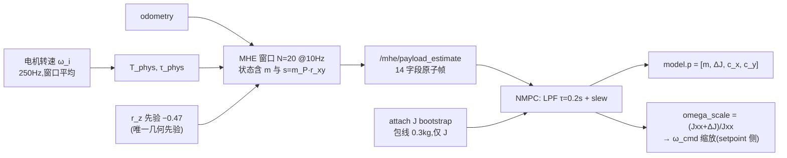

# viz 场景下 m / J / c 的全生命周期

按 `scripts/gripper/run_sitl_gripper_viz.sh` 的**当前默认档位**，逐阶段说明质量 $m$、
一阶质量矩 $s = m_P r_{xy}$、惯量增量 $\Delta J$、复合质心水平偏移 $c_{xy}$ 这几个量在
**MHE** 与 **NMPC** 两侧分别怎么变、被谁写、被谁用。

阶段：**ATTACH → 巡航（LIFT + 悬停）→ 八字 → DROP → DROP 后**。

> [!abstract] 2026-09-04 的接口大改（本次改写的主因）
> `6419cbe` 把 MHE→NMPC 换成**单条原子连续接口** `/mhe/payload_estimate`，并把
> 一阶质量矩默认打开。相对本文上一版（基准 `ea899ae`），下列结论**已被推翻**：
>
> | 旧版说法 | 现状 |
> |---|---|
> | $m$ 走 `/mhe/mass_est`、$c$ 走 `/acados_nmpc/c_xy_est`、$J$ 不发话题 | 三者**同一帧**走 `/mhe/payload_estimate`（14 字段），$J$ 现在**是**发的 |
> | attach 时 $\Delta J$ 写 floor `0.0108` | 写 **bootstrap 包线** `0.0579`，随后交接给 MHE |
> | attach 改写 PX4 `MC_*RATE_K`（×5.0），drop 复位 | **不再改 PX4 参数**；改走 setpoint 侧 `omega_scale` |
> | 一阶质量矩 `MHE_ESTIMATE_MOMENT` 默认关 | **默认开**（`moment_a_mode=frozen`） |
> | $c_{xy}$ 在八字里完全冻结 | `c_xy_from_moment` 默认开 ⇒ **机动中每帧更新** |
> | MHE 仍吃 `attach_offset` 真值 | 主线档 `_model_r_p` 只用 $r_z$ 弱先验，**attach/drop 都不进 MHE** |
> | drop 同帧清几何、`grip_dropped=True` | drop 进 **pending**，等 `no_payload_confidence` 确认才 complete |
> | `self` 档 drop 后 $m_{est}$ 偏低 −2.81 % | 09-04 实跑 **−0.27 ~ −0.66 %**，不触下界 |
> | M0 ⇒ 确认阈值固定 1.5 N | 脚本 M0 分支现在给 $\alpha=1.5$ ⇒ **4.4 N** |
>
> 09-02 那批工况改动（0.15 kg / 包线 0.3 / $r$=10 / $z$=6.0 / 4 m/s）**仍然有效**，
> 与更早的批次不可直接对比。

---

## 0. 档位与常数

### 0.1 关键参数

**场景（工况）**

| 参数 | 值 | 含义 |
|---|---|---|
| `GRIP_PAYLOAD_KG` | **0.15** kg | 载荷真值（只用于评估对表） |
| `GRIP_PAYLOAD_ENVELOPE` | **0.3** kg | 机架规格，**不是**包裹质量 |
| `GRIP_ECC_Y` / `GRIP_ATTACH_TOL` | 0.10 / 0.03 m | attach 偏心上限 $r_{xy}=0.13$ |
| `GRIP_DYN_R` / `W` / `RAMP` / `DZ` | 10.0 / 0.283 / 9.36 / 0.8 | 八字，$v_{peak}=4.0$ m/s |
| `GRIP_Z_HIGH` / `LIFT_DUR` | 6.0 m / 8.4 s | 爬升率 0.649 m/s |
| `GRIP_LIFT_AFTER` | **1.5** s | ★ 09-04 新透传；**实跑用 3.0**，见 §5 坑 1 |
| `GRIP_DROP_AFTER` / `DROP_AT_TIP` | 55.0 s / true | 粗门 + 尖点对齐 |
| `GRIP_LIFT_HOLD` | false | LIFT 中途停顿档（默认关） |
| `METHOD` | `M0` | ⇒ $\theta=[-4,0,0,0]$、$\alpha=1.5$ |

**NMPC（连续接口）**

| 参数 | 值 | 含义 |
|---|---|---|
| `continuous_payload_estimates` | **`true`** | ★ `/mhe/payload_estimate` 是**唯一**载荷输入 |
| `geom_source` | **`estimate`** | 被上一条强制（写别的值会被覆盖） |
| `NMPC_GEOM_COUPLED` | `0` | 连续档**要求**为 0，否则 `__init__` 直接 `RuntimeError` |
| `attach_j_bootstrap_enable` | **`true`** | attach 时按包线抬 $\Delta J$ 地板 |
| `attach_j_bootstrap_confirm_sec` / `release_sec` | 0.5 / 0.5 s | 交接确认 / 淡出时长 |
| `attach_j_bootstrap_min_dj` | 0.010 kg·m² | 交接需要的最小 MHE $\Delta J$ |
| `omega_scale_enable` / `_source` | **`true`** / `djest` | ★ 增益调度走 setpoint 侧 |
| `omega_scale_tau` / `_cap` | 0.5 s / 5.0 | 一阶低通 + 硬上限 |
| `omega_scale_hysteresis` / `rise` / `recover` | 0.08 / 4.0 / 1.5 s⁻¹ | 目标滞回 + 非对称 slew |
| `omega_scale_headroom_fraction` | 0.95 | 保 5 % 体速率余量 |
| `scale_px4_rate_gains` | **`false`** | ★ = `not continuous`；**PX4 参数不动** |
| `payload_model_tau_sec` | 0.20 s | 模型侧 LPF |
| `payload_mass_slew_kg_s` / `moment` / `dj` | 0.60 / 0.080 / 0.080 | 每秒最大变化 |
| `no_payload_confidence_threshold` / `_hold_sec` | 0.90 / 1.0 s | drop 完成判据 |
| `payload_estimate_fresh_sec` | 0.35 s | ROS 收帧新鲜度 |

**MHE**

| 参数 | 值 | 含义 |
|---|---|---|
| `external_event_inputs` | **`false`** | ★ 不订阅 `attach_offset` / `mass_event` / `u_opt`（sensor-only） |
| `MHE_GEOM_COUPLED` | `1` | 几何槽装 $r_p$，$J(m)/c(m)$ 模型内现算 |
| `MHE_ESTIMATE_MOMENT` | **`1`** | ★ 一阶质量矩 $s=[s_x,s_y]$ 增广为状态（`ns=2`） |
| `MHE_MOMENT_A_MODE` | **`frozen`** | ★ $A=\mu r_z^2$ 用**上一窗口** $\hat m$ 现算，窗口内 $\partial A/\partial m\equiv 0$ |
| `MHE_SIGMA_S0` | 0.1 | $s$ 的到达代价（实质无先验） |
| `MHE_C_XY_FROM_MOMENT` | **`true`** | ★ $c_{xy}=s/m_T$，**无稳态门控** |
| `event_signal_mode` | `residual` | 无外部信号，从 $T_{phys}$ 残差自触发 |
| `confirm_thresh_alpha` | **`1.5`** | ⇒ 阈值 $=\alpha g\,\text{env}=$ **4.4 N**（实跑覆盖成 −1 ⇒ 1.5 N） |
| `resid_persist_frames` / `resid_step_enable` | 2 / `false` | 第二段确认 / 并行阶跃判据关 |
| `c_xy_mass_release_mp` / `arm_ratio` / 两个 persist | 0.03 kg / 3.0 / 20 / 20 帧 | 质量域卸载判据（武装 0.09 kg，各持 2 s） |
| `payload_present_enter_mp` / `_persist` | 0.09 kg / 20 帧 | 载荷存在状态机进 |
| `payload_present_exit_mp` / `_persist` | 0.02 kg / 50 帧 | 出（5 s，更慢） |
| `s_release_ratio` / `_persist` | 0.10 / 20 帧 | 辅助判据：$\lvert s\rvert$ 跌破自身峰值 10 % |
| `payload_input_fresh_sec` / `solution_fresh_sec` | 0.30 / 0.30 s | `healthy` 的两个条件 |
| `payload_output_tau_sec` | 0.25 s | 发布侧 LPF |
| `MHE_RZ_PRIOR` | **−0.47** m | 唯一保留的几何先验（真值实测 −0.579） |
| `geom_release_mode` | `self` | 主线下**对模型槽无效**（见 §3.1） |
| `MHE_RESID_RELEASE_GEOM` | `true` | 残差检出即释放几何 |
| `payload_lost_watch` | `false` | 演示视频用 `1` 打开 |

> [!warning] 脚本里还在传、但主线**不再消费**的参数
> 连续档下 `_update_online_geometry` 根本不被调用、`_geom_slot` 走 continuous 分支、
> `_grip_drop_phase` 走 pending 分支，所以这几个仍在命令行里的参数是**死参数**：
> `dj_track_mest`、`dj_ratchet_enable`、`grip_dj_floor_mp`、`grip_mp_cap`、
> NMPC 侧的 `geom_release_mode`、`drop_publish_mass_event`。
> 改它们不会改变任何行为——查问题时别在这几个上浪费时间。

### 0.2 物理常数与派生量

| 量 | 值 |
|---|---|
| 空机质量 $m_B$ | 2.0643 kg |
| 空机惯量 $J_{xx}$ | 0.0142 kg·m² |
| 惯量先验力臂 $r_z$ (`MHE_RZ_PRIOR`/`grip_arm_d`) | −0.47 m（实测真值 −0.579） |
| 载荷真值 $m_P$ / 总质量 | 0.15 / 2.2143 kg |
| 悬停推力 $T$ | 21.72 N |
| 力矩约束 $\tau_{max}$ | 0.5 N·m |
| MHE 窗口 | $N\cdot dt = 20\times 0.1 = 2.0$ s |
| NMPC 求解 | $dt=0.05$ s（20 Hz），horizon 1.0 s；解耦发布 50 Hz |

连续接口的惯量代数（`payload_estimate.inertia_from_mass_moment`，**只留对角、丢掉
$O(r_{xy}^2)$ 项**）：

$$
c_{xy} = \frac{s}{m_T},\qquad
\mu = \frac{m_B\,m_P}{m_T},\qquad
\Delta J_{xx} = \Delta J_{yy} = \mu\, r_z^2,\qquad \Delta J_{zz} = 0
$$

| $m_p$ 来源 | $m_p$ [kg] | $\Delta J$ | $J_{xx}+\Delta J$ | $\omega$ 缩放比 |
|---|---|---|---|---|
| 空机 | 0 | 0 | 0.0142 | 1.00 |
| **实测 $\hat m_p$** | **≈0.128** | **0.0267** | 0.0409 | **2.88** |
| 真值 | 0.15 | 0.0309 | 0.0451 | 3.18 |
| **bootstrap 包线** | **0.30** | **0.0579** | **0.0721** | **5.08 → cap 5.0** |

配平力矩（$r_y$ 实测 −0.101 m）：

$$
\tau_{trim} = c_y T = m_P g\, r_y \approx 0.149\ \text{N·m} = 30\ \%\ \tau_{max}
$$

---

## 1. 三个量的存放与流向



`/mhe/payload_estimate` 是 `std_msgs/Float64MultiArray`，字段顺序由
`payload_estimate.FIELDS` 唯一定义：

```text
[m_total, s_x, s_y, c_x, c_y,
 dJ_xx, dJ_yy, dJ_zz, J_xx, J_yy, J_zz,
 no_payload_confidence, healthy, solution_age_sec]
```

| 量 | MHE 侧 | NMPC 侧 |
|---|---|---|
| $m$ | 被估状态（窗口第 14 维） | `self.m_est`，LPF + slew 0.60 kg/s |
| $s$ | **被估状态**（`ns=2`），有独立观测 $\tau/T$ | `self.s_est`，slew 0.080 kg·m/s |
| $\Delta J$ | 由 $m,s,r_z$ 代数派生后发布 | `self.dJ_est`，slew 0.080 kg·m²/s，attach 期叠 bootstrap 地板 |
| $c_{xy}$ | $s/m_T$（发布字段；另有 `c_xy_est` 诊断话题） | `self.c_est = s_est / m_est` |

> [!question] 上一版说"$J$ 不该发话题"，为什么现在发了
> 旧论证的三条理由**在旧接口下仍然成立**，改变的是接口本身：
> 1. **不再是"零新增信息"**：$s$ 增广后 $J$ 不再是 $m$ 的确定性函数，$\Delta J$ 与
>    $c_{xy}$ 各自带着 $s$ 的信息。NMPC 只拿 $m$ 已经推不出来了。
> 2. **防护没有撤掉，只是换了形式**：`floor/cap` 换成 **LPF + slew + attach bootstrap
>    地板**，且失效帧（`healthy=0` 或 `solution_age>0.30 s`）会**冻住模型**而不是跟随。
> 3. **表示对上了**：MHE 的非对角项**不出接口**，发的是 roll/pitch 对角增量，
>    与 NMPC legacy 槽同构。
>
> 代价写在明处：$O(r_{xy}^2)$ 项两边都被**故意丢掉**（病态），$r_z$ 用弱先验
> −0.47 而真值 −0.579（低估 19 %）——$\Delta J$ 只需量级对。

---

## 2. 时间线

以 **attach 命令时刻** $T_a$ 为原点。注意这个锚点的定义变了：连续档下
NMPC **不订阅** `/gripper/attach_offset`，`attach_time` 就是它自己发
`/gripper/enable=true` 的那一刻（`grip_descend_done_time`），不再等夹爪回执。

| 相对时刻（默认 `lift_after`=1.5） | 事件 | 性质 |
|---|---|---|
| $T_a$ | **ATTACH 命令**发出，J bootstrap 武装 | 事件 |
| $T_a + 1.5$ | LIFT 斜坡开始，$z: 0.55 \to 6.0$ | 事件 |
| $T_a + \sim 3$ | box 离地；MHE 见到推力台阶 | 物理 |
| $T_a + \sim 5$ | **bootstrap 交接**（持续证据 0.5 s 确认）→ 0.5 s 淡出 | 状态 |
| $T_a + 9.9$ | `lift_done_t` = $T_a$ + 1.5 + 8.4 | **公式** |
| $T_a + 12.9$ | **DYNAMIC** 切换，`grip_dyn_t0` = 此刻（+`dyn_settle` 3.0） | 事件 |
| $T_a + 14.9$ | 八字 `hover_time` 2.0 结束，相位开始推进（$t_c=0$） | — |
| $T_a + 75.96$ | **DROP 命令**：第一个 $t_c \ge 50$ 的尖点（$t_c = 61.06$） | 事件 |
| $T_a + \sim 78.4$ | **DROP complete**：$conf \ge 0.90$ 持续 1.0 s | 状态 |

### 2.1 DROP 门槛怎么算

粗门只说"哪一圈以后可以丢"，真正的时刻由八字相位定：

$$
t_c = t - t_0^{dyn} - 2.0, \qquad
t_c^{thr} = \texttt{drop\_after} - 5.0, \qquad
t_c^{tip}(k) = \frac{3\pi/2 + 2\pi k}{w}
$$

净偏移 5.0 = `dyn_settle 3.0` + `hover_time 2.0`；`lift_after` 与 `lift_dur`
**自动抵消**（$t_{drop}$ 与 $t_0^{dyn}$ 都锚在 `attach_time` 上）。所以把
`GRIP_LIFT_AFTER` 从 1.5 改到 3.0 **不必**重算 `DROP_AFTER`，只是整条时间线
整体后移 1.5 s。

$w = 0.283$ ⇒ 周期 22.20 s：

| $k$ | $t_c^{tip}$ | 圈数 |
|---|---|---|
| 0 | 16.65 | 0.75 |
| 1 | 38.85 | 1.75 |
| **2** | **61.06** | **2.75** ← 第一个 ≥ 50.0 |

> [!warning] 改 `GRIP_DYN_W` 必须重算 `GRIP_DROP_AFTER`
> 门槛写的是**秒**，兑现的是**圈数**，汇率就是 $w$。同一个 `55.0`：
> $w{=}0.20$ 只飞 **1.75 圈**，$w{=}0.283$ 飞 **2.75 圈**，$w{=}0.40$ 飞 **3.75 圈**。
> 当 $t_c^{thr}$ 贴近某个尖点时（本档临界 $w \approx 0.3456$），$w$ 微调会让 drop 时刻
> 在"立刻"与"再飞一整圈"之间跳变。
> 改 $r$、`ramp`、`dz`、`lift_dur`、`lift_after`、`z_high` **都不影响相位**。

### 2.2 drop 那一瞬间的状态

$a = 3\pi/2 \Rightarrow \sin a = -1,\ \cos a = 0,\ \cos 2a = -1$：

| 量 | 值 | 说明 |
|---|---|---|
| $x$ | $c_x - 10.0$ m | 八字**最左端**（$x$ 的折返点） |
| $y$ | $c_y$ | 正好在中线 |
| $z$ | $6.0 - 0.8 = 5.2$ m | **轨迹最低点** |
| $v_x,\ v_z$ | 0 | 都正比于 $\cos a$ |
| $v_y$ | $-2.83$ m/s | $rw\cos 2a$ |

box 底离地 4.73 m，自由落体 0.98 s 落地，期间横移约 2.78 m。

### 2.3 2026-09-04 实跑对照

三轮 viz（脚本默认 + 命令行覆盖 `MHE_CONFIRM_ALPHA=-1`，即把确认阈值调回固定 1.5 N）：

| 轮次 | `lift_after` | ATTACH | LIFT | DYNAMIC | DROP 命令 | DROP complete | solve failed | 结局 |
|---|---|---|---|---|---|---|---|---|
| `162428` | **1.5**（脚本默认） | 6.6 | 8.1 | 19.5 | 82.6 | — | **822** | **发散**（tilt 141°、pos_err 70 m） |
| `163315` | 3.0 | 6.4 | 9.4 | 20.8 | 83.9 | +2.34 s | 0 | 正常 |
| `164651` | 3.0 | 6.4 | 9.4 | 20.9 | 84.0 | +2.40 s | 0 | 正常 |

单位 s，相对 NMPC 接管时刻。$T_a$ 到 DROP 命令实测 77.6 s ≈ 公式的 $1.5+74.46$。

---

## 3. 逐阶段

### 3.1 阶段一：ATTACH（$T_a$）

触发链：`_descend_phase` 发 `/gripper/enable=true` → proximity 焊 box。
**这条链到此为止**：NMPC 不再订阅 attach 回执，MHE 也不订阅——`attach_offset`
在主线里只剩 proximity 自己的日志（评估对表用）。

#### NMPC（`_grip_mass_step`，continuous 分支）

| 量 | 动作 |
|---|---|
| $m,\ s$ | **完全不动**，纯跟 MHE |
| $\Delta J$ | 武装 **bootstrap**：地板 = 包线 0.3 kg ⇒ $\Delta J = 0.0579$、$J_{xx}=0.0721$ |
| $c_{xy}$ | 仍是 $s_{est}/m_{est}$，**不置零、不注真值** |
| `omega_scale` | 随 $\Delta J$ 连续爬到 cap 5.0（实测 4.998） |
| PX4 参数 | **不动**（`scale_px4_rate_gains=false`） |

```python
self.grip_mass_stepped = True
self.attach_time = self.grip_descend_done_time   # 锚在自己的 enable 命令
self._start_attach_j_bootstrap()                 # 只抬 J，不造 m/s
```

> [!info] 为什么 bootstrap 只动 $J$
> 箱子还站在地上时，**惯量不可观测**（载荷的重量走地面支持力，转动通路没有激励），
> 而 LIFT 一开始就需要正确的内环带宽。所以给 $J$ 一个保守的、临时的**下界**——
> 用包线（机架规格，不是任务信息），并且**只给 $J$**：不注入载荷质量，也不注入
> $s_{xy}$，那两个继续纯估计。
>
> 交接条件三条同时满足：估计帧新鲜、$\Delta J_{MHE} \ge 0.010$、
> $conf < 0.75$（阈值 −0.15），持续 0.5 s ⇒ 地板按 0.5 s 线性淡出。
> 实测 attach 后 4.9~5.0 s 交接，$\Delta J$ 从 0.0579 → 0.0267。

> [!danger] bootstrap 期是当前最脆的一段
> 地板把内环增益推到 5×，**若此时 box 其实没吸稳**，等于给接近空机的构型上带载增益
> —— 就是 07-14 那个过增益振荡崩法。09-04 `162428` 轮（`lift_after`=1.5）实测
> LIFT 段直接发散：822 次 solve failed、tilt 141°、`om_scale` 钉在 5.0、
> MHE `health=0` 持续 21 s。`lift_after`=3.0 的两轮同一档位干净通过。
>
> 还有一条设计上的冻结：**交接已开始、估计随后失效**时，代码选择**冻住**当前
> $\Delta J$（`if bootstrap_active and releasing and not fresh: return`），
> 而不是把地板放掉——放掉会复现原始的 LIFT 失效。代价是估计器垮掉时
> `om_scale` 会**停在高位**（`162428` 的 5.0 就是这么来的）。

#### MHE

| 量 | 动作 |
|---|---|
| $m$ | 不动，靠窗口自己爬 |
| $s$ | 同样靠窗口爬；有独立观测 $\tau/T$，不依赖 $m$ 收敛 |
| 几何槽 | **恒为** $[0,0,r_z^{prior}]$ —— attach/drop 都不改它 |
| 事件 | `residual` 自触发；`external_event_inputs=false` ⇒ 没有任何外部武装 |

```python
def _model_r_p(self):
    if not self.external_event_inputs and mhe_p.estimate_moment:
        return np.array([0.0, 0.0, mhe_p.rz_prior])   # 主线：提前返回
    ...  # 下面 self/event 两档的老逻辑主线走不到
```

> [!important] `geom_release_mode` 在主线下是**空转**的
> 上面那个提前 `return` 意味着 `self` / `event` 两档的差别对**模型几何槽**不再生效：
> 横向几何全部由被估的 $s$ 承担，纵向只有 $r_z$ 弱先验，且**永远在线**。
> 启动日志里那条 `geom_release_mode='self'` 的警告仍会打印，但它描述的是老路径。
> `_release_payload` 本身还在用——它现在管的是**发布侧的 $s$ 释放闩**（§3.4）。

耦合档模型内部（与 `mhe_model.py` 逐字同源）：

$$
m_P = (m - m_B)^+,\quad \mu = \frac{m_B m_P}{m},\quad
A = \mu r_z^2\ \text{(frozen)},\quad c = \frac{s}{m}
$$

> [!note] `moment_a_mode=frozen` 是什么意思
> $A=\mu r_z^2$ 用**上一窗口解出的** $\hat m$ 现算（借 `geom[0]` 槽传进来）。
> 于是窗口内 $\partial A/\partial m \equiv 0$ —— 优化器**不能把 $m$ 当惯量旋钮**；
> 但 $A$ 的数值每拍仍跟着真实质量刷新，不像 `const` 那样被包线钉死
> （0.15 kg 载荷配 0.3 kg 包线 = $A$ 过估 2×）。
> 离线 attach/drop 回放：`coupled` 档 drop 后 $m$ 偏高 **+53 %**，`frozen` 回到空机
> **−0.34 %**，$s/\Delta J$ 同步衰减、无下界触碰、solve fails = 0。

---

### 3.2 阶段二：巡航（LIFT + 悬停）

这是全程 $m$、$s$ 信息质量最好的一段：box 已离地（载荷全额加载），飞机还没进大机动。
本档 LIFT 长达 8.4 s（爬到 6 m）。

NMPC 每次 solve 前调 `_update_continuous_payload_model`：

```python
alpha = 1 - exp(-dt / 0.20)                      # LPF τ=0.2s
m_est  = slew(m_est,  lpf(m_target),  0.60, dt)  # kg/s
s_est  = slew(s_est,  lpf(s_target),  0.080, dt) # kg·m/s
dj_tgt = dj_mhe + w_bootstrap * max(dj_floor - dj_mhe, 0)
dJ_est = slew(dJ_est, lpf(dj_tgt),    0.080, dt) # kg·m²/s
c_est  = s_est / m_est                           # 横向质心只认一阶质量矩
```

> [!important] 失效帧的语义是"冻住"，不是"归零"
> `_payload_estimate_is_fresh()` 要求 MHE 自报 `healthy=1`、
> `solution_age <= 0.35 s`、且 ROS 收帧不陈旧。任何一条不满足：
> **保持上一帧模型**，并且**打断** `no_payload_confidence` 的连续计时
> （置零而不是暂停）。日志里是 `[payload-health] unhealthy/stale; holding model`。

#### 09-04 实测（`164651`，带载段）

| 量 | 估计 | 真值 | 偏差 |
|---|---|---|---|
| $\hat m_p$ | 0.123 ~ 0.132 kg | 0.15 | **低估 ~14 %** |
| $\hat s_y$ | −0.0149 ~ −0.0154 kg·m | −0.01515 | **2 % 以内** |
| $\hat s_x$ | −0.005 ~ −0.011 kg·m | +0.0006 | 系统性偏负 ~0.01 |
| $\Delta J$ | 0.0267 | 0.0309 | 低估 14 %（跟着 $m_p$） |

（真值来自 proximity 的 `attach offset = [+0.004, −0.101, −0.579] m`，
$s_{true} = m_P r_{xy}$。）

> [!note] $s$ 准而 $m$ 低估——两件事，别混
> $s_y$ 准到 2 % 以内，说明**横向一阶矩这条观测通路是干净的**（$\tau/T$ 直接给它）。
> 而 $m$ 低估 14 % 是既有的"机动中质量低估"问题在小载荷上的放大
> （$m_p = \hat m - m_B$ 的差分放大 ~7.9×，见记忆 `mest-maneuver-underestimate`）。
> 因为 $c = s/m$，$m$ 低估会让 $c$ **高估** ~14 %，反解出的 $\hat r_y \approx -0.116$ m
> 而真值 −0.101 —— 力臂的表观误差是质量误差借道过来的，不是几何估歪了。
> $s_x$ 那 0.01 kg·m 的偏置对应 $c_x \approx -4.6$ mm，与既有的 pitch 通道污染
> （$c_z\times$前倾）同源。

---

### 3.3 阶段三：八字（$v_{peak} = 4.00$ m/s）

轨迹：$x = \alpha r\sin a$，$y = \tfrac12\alpha r\sin 2a$，$z = z_h + \alpha\,dz\sin a$，$a = wt_c$。
$r{=}10.0$，$w{=}0.283$，$dz{=}0.8$ ⇒ 包络 20 m × 10 m。

| 量 | 这一段的行为 |
|---|---|
| $m$ | 照常 10 Hz 更新（机动会抬高估计误差，通路不变） |
| $s$ | **照常更新**——窗口内被估状态，与稳态无关 |
| $\Delta J$ | 跟随 $(m,s)$，双向，LPF + slew |
| $c_{xy}$ | **每帧更新**（$= s/m_T$），不再冻结 |

> [!success] $c_{xy}$ 的冻结问题已经解决
> 上一版记的坑是"峰值速度 4.00 m/s 是稳态门限 0.20 m/s 的 20 倍 ⇒ 八字里
> $c_{xy}$ 一次都不更新，drop 后 60 s 仍报 $c_y=-4.8$ mm"。
> `MHE_C_XY_FROM_MOMENT=true` 后走的是另一条路：
>
> ```python
> if self.c_xy_from_moment and mhe_p.ns:
>     self.c_xy_est = self.s_est / max(m_est, m_min)   # 无门控,直接发
>     return
> ```
>
> 窗外 EMA + 稳态门控那条老路整段被跳过。启动日志会打印
> `[c_xy] 来源 = 一阶质量矩 s/m_T(窗口内估计,**无稳态门控**)`。
> 注意：NMPC 主线**不订阅** `/acados_nmpc/c_xy_est`（它从原子帧拿 $c$），
> 这条话题现在只是诊断/兼容出口。

#### 内环增益：从改 PX4 参数改成缩 setpoint

| | 旧（≤09-02） | 新（主线） |
|---|---|---|
| 手段 | `ParamSetV2` 改写 `MC_ROLLRATE_K/MC_PITCHRATE_K` | 缩放发给 PX4 的 `body_rate` setpoint |
| 时机 | attach 一次性，drop 复位 | **每帧连续**（`_update_omega_scale`） |
| 副作用 | 参数被 PX4 当真机落盘，污染后续架次 | 无；PX4 参数全程不动 |

$$
s_\omega = \mathrm{clip}\!\left(\frac{J_{xx}+\Delta J}{J_{xx}},\,1,\,5\right),
\qquad
\omega_{cmd}' = \omega + s_\omega\,(\omega_{cmd} - \omega)
$$

只作用 roll/pitch。目标带 0.08 滞回（Schmitt 式死区），再过 $\tau=0.5$ s 低通，
上行 slew 4.0 s⁻¹、下行 1.5 s⁻¹（恢复要慢）。发布前还有一道
`headroom_limited_scale`：把公共比例压到不会顶穿 $0.95\,\omega_{max}$，
方向不变、下限 1.0。

实测（`164651`）：bootstrap 期峰值 4.998（触发过一次
`headroom limited 4.98→4.38`），带载八字段稳定在 **2.85 ~ 3.10**，
drop 后连续回落到 **1.00**。

> [!caution] 这一段仍有饱和
> `[flight-diag] t=15.6s`（LIFT/交接期）实测 `u_sat=[T0 r0 p15.0 y0]%`、
> `mot_peak=1.000 mot_sat=9.0%`。跟踪本身没问题（末段 `pos_err` 0.03~0.08 m），
> 但 pitch 力矩通道在这一段确实短暂打满——与既有认知
> （4 m/s 工作点真瓶颈是力矩不是推力）一致。

---

### 3.4 阶段四：DROP

> [!abstract] drop 不再是"一帧的事"
> 释放指令改变的是**被控对象**，不是控制器模型。所以 NMPC 发完指令进入
> **pending**，继续消费正在衰减的估计；只有 MHE 的空载置信度**持续**达标，
> 才算 complete 并复位自适应状态。

#### NMPC（`_grip_drop_phase`，continuous 分支）

```python
self.enable_pub.publish(Bool(data=False))   # → proximity 释放 box
self.grip_drop_pending = True               # 不是 grip_dropped
self._no_payload_latched = False            # 无条件重新武装空载检测
self._no_payload_conf_frames = 0
# 不发 mass_event、不清 dJ/c、不碰 PX4 参数
```

完成判据在 `_confirm_no_payload_if_persistent`（每次 solve 前）：
$conf \ge 0.90$ **连续** 1.0 s（且期间每帧估计都新鲜），才置
`grip_drop_done/grip_dropped`、复位 L1 与 $\xi$。

实测：DROP 命令 → complete **+2.34 s / +2.40 s**（两轮），$conf$ 到 0.998 / 0.999。

> [!info] 无条件 re-arm 是补出来的
> `_no_payload_latched` 是一次性闩。attach 没成功的轮次里 $conf$ 全程 1.0，
> 闩在起飞后不久就被消耗掉，等真发 drop 指令时
> `_confirm_no_payload_if_persistent` 第一行就 `return`，**DROP 永远 complete 不了**
> （96 架次批次 #19 实测）。发释放指令这一刻是明确边沿，此处无条件复位。
> 两条 drop 路径（`_drop_phase` / `_grip_drop_phase`）必须对称，漏一条就是下次的坑。

#### 空载置信度怎么算

三个**独立**的"空"证据取**乘积**（`payload_estimate.no_payload_confidence`），
每个都是 C1 平滑的 1→0 过渡：

| 通道 | full（记 1.0） | zero（记 0.0） |
|---|---|---|
| 质量 $m_p$ | 0.015 kg | 0.060 kg |
| 一阶矩 $\lVert s\rVert$ | 0.0015 kg·m | 0.0060 kg·m |
| 惯量 $\max\lvert\Delta J_{xy}\rvert$ | 0.0020 kg·m² | 0.0100 kg·m² |

> [!success] 用乘积是**故意**的：一条明确的"有载荷"指示就足以否决"空"
> 尤其是 $s$：即便质量估计恰好触到下界 $m_{min}=1.961$（历史上的常态），
> 只要 $\lVert s\rVert$ 还不为零，$conf$ 就压得住。
> 这正是 96 架次主线批次里 `_release_payload` 从未被调用过的那个阻塞缺陷的反面——
> 当时 $s$ 不被释放，$conf$ 恒 0.000，谁也进不去。

#### MHE 侧：谁把 $s$ 送回零

MHE 收不到任何事件，靠三条路自己熄灭：

| 对象 | 机制 |
|---|---|
| $m$ | 窗口从当前值**连续收敛**回空机，无阶跃（一直如此，故意的） |
| 模型内 $J,c$ | $m_P=(m-m_B)^+ \to 0$、$s \to 0$ 自行熄灭；几何槽 $[0,0,r_z]$ 不变 |
| **发布的 $s$** | `_release_payload` 置 `_s_release_latched=True` ⇒ 发布目标切零，`_s_out` 按 LPF（τ=0.25 s）连续衰减 |

触发 `_release_payload` 的三条路（`_update_c_xy_est` / `_residual_detect` 内）：

1. **残差自检测**（`resid_release_geom=true`）—— 09-04 三轮实际走的就是这条，
   日志 `载荷释放(no-signal residual)`；
2. **质量域卸载判据**：武装（$m_p > 0.09$ kg 持 20 帧）后，$m_p < 0.03$ kg 持 20 帧；
3. **辅助判据**：已武装且 $\lVert s\rVert$ 跌破**自身峰值**的 10 % 持 20 帧
   —— 覆盖"$\hat m$ 卡在带载值但 $s$ 已回零"这类质量域看不见的情形。

实测 `[s-decay]`（`164651`，10 Hz）：

| 帧 | 1 | 4 | 7 | 11 | 16 |
|---|---|---|---|---|---|
| $\lVert s_{out}\rVert$ | 0.01009 | 0.00304 | 0.00091 | 0.00018 | 0.00002 |
| $conf$ | 0.000 | 0.022 | 0.611 | 0.921 | 0.989 |

即释放闩生效后约 **1.1 s** 越过 0.90 阈值，再持 1.0 s 由 NMPC 判 complete。

> [!warning] 阈值这一档是**故意调高**的，但实跑覆盖了它
> 脚本 M0 分支给 `confirm_thresh_alpha=1.5` ⇒ $\alpha g\cdot\text{env} = 4.4$ N，
> 而 0.15 kg 卸载的推力台阶只有 $m_P g = 1.47$ N —— 等于**把残差这条路堵死**，
> 逼 drop 只能由质量域判据检出，这正是无信号主线想展示的东西。
> 但 09-04 三轮实跑都传了 `MHE_CONFIRM_ALPHA=-1`（回到固定 1.5 N），
> 于是残差路重新打开、drop 由它检出。**看日志先确认 `thresh=` 那一行是 1.5 还是 4.4。**

#### 其他释放路径（本档关）

| 路径 | 触发 | 默认 |
|---|---|---|
| 外部 `mass_event` | NMPC 松爪同帧发 | **关**（`external_event_inputs=false`，连订阅都没建） |
| 残差阶跃判据 | `resid_step_enable` | 关 |
| 看门狗 | `_payload_lost_watch` → `/mhe/payload_lost` | 关；**且主线 NMPC 不订阅该话题** |

---

### 3.5 阶段五：DROP 后

| 量 | NMPC | MHE |
|---|---|---|
| $m$ | 跟原子帧连续回落 | 连续收敛回空机 |
| $s$ | 跟 `_s_out` 衰减到 0 | 发布目标闩零，窗口内 $s_{est}$ 仍有残噪 |
| $\Delta J,\ c$ | 随 $(m,s)$ 自然回零 | 同左 |
| `omega_scale` | 按 1.5 s⁻¹ 恢复到 1.00 | — |
| PX4 参数 | 全程没动过，无需复位 | — |

> [!success] `self` 档"drop 后 $m_{est}$ 偏低"的老坑，在 moment 档下没有复现
> 旧记录：`geom_release_mode='self'` 下 drop 后 $m_{est}$ 系统性偏低 **−2.81 %**、
> 55 个采样里 14 个贴在 $m_{min}$ 上。机理是"载荷在不在"这个信息被硬编码进了质量——
> 杆臂还在模型里，优化器只能把 $m_P^+$ 压到 0 才能消掉幽灵偏心。
>
> $s$ 增广正是对症的修法（$s$ 有独立观测，会自己趋零，$m$ 不再被逼向下界），
> 而它**现在默认开着**。09-04 实测 drop 后 $\hat m$ = 2.0507 ~ 2.0587
> （相对 $m_B$ **−0.27 % ~ −0.66 %**），**一次都没碰下界 1.961**。
> 上一版那句"用了 `self`，却没开配套的 2b"已经不成立。

> [!danger] 仍然成立：控制器绝不能按幽灵偏心飞
> 旧实测（0.3 kg 档）：drop 后控制器继续按幽灵偏心配平，指令 0.424 N·m
> （$\tau_{max}$ 的 85 %）作用在空机 $J_{xx}$ 上 = 29.8 rad/s²，2/2 坠机。
> 新架构里这条防线换了位置：不再靠"NMPC 自己清几何"，而是靠
> **$s$ 的连续衰减 + $conf$ 确认**。所以 `[s-decay]` 那串日志是安全相关的，
> 不是诊断噪声——它若不下降，就是这条防线没生效。

---

## 4. 总表：4 量 × 5 阶段

### 4.1 NMPC 侧

| | ATTACH | 巡航 | 八字 | DROP 命令 | DROP 后 |
|---|---|---|---|---|---|
| $m$ | 不动 | 跟原子帧 | 跟原子帧 | **继续跟** | 跟到空机 |
| $s$ | 不动 | 跟原子帧 | 跟原子帧 | **继续跟**（衰减中） | → 0 |
| $\Delta J$ | **bootstrap 0.0579** | 交接 → MHE 值 0.0267 | 跟随 | 继续跟 | → 0 |
| $c_{xy}$ | $s/m$（≈0） | $s/m$ | $s/m$，**每帧更新** | $s/m$ | → 0 |
| `omega_scale` | → cap 5.0 | 交接后 ~2.9 | 2.85 ~ 3.10 | 开始回落 | 1.00 |
| 状态机 | `grip_mass_stepped` | — | — | `grip_drop_pending` | `grip_dropped`（+2.4 s） |

### 4.2 MHE 侧

| | ATTACH | 巡航 | 八字 | DROP | DROP 后 |
|---|---|---|---|---|---|
| $m$ | 不动，靠窗口爬 | 收敛（低估 ~14 %） | 继续估 | 不动 | 连续回空机 −0.3 ~ −0.7 % |
| $s$ | 靠窗口爬 | 准（$s_y$ 误差 <2 %） | 继续估 | 释放闩 → 目标零 | `_s_out` LPF → 0 |
| 几何槽 | $[0,0,-0.47]$ | 同左 | 同左 | 同左 | 同左（**永不变**） |
| $conf$ | 1.0 → ~0 | ~0 | 0.000 | 上升 | ≥0.99 |
| 降权 | 残差自触发 | — | — | 残差 / 质量域 / $s$ 塌陷 | — |

### 4.3 一句话

> **载荷认知只有一条路**：MHE 用 motor speed + odometry 估 $(m, s)$，
> 派生 $(c, \Delta J)$，打成一帧发出去；NMPC 平滑限速后喂模型和增益调度。
>
> **attach 和 drop 都不是"通知"，是"命令 + 确认"**：
> NMPC 发命令后只给 $J$ 一个临时安全地板（attach）或进入等待（drop），
> 真正的状态转移由估计器的持续证据决定。
> 全链路唯一保留的先验是机架的 $r_z \approx -0.47$ m。

---

## 5. 已知的坑与不一致

| # | 问题 | 现状 |
|---|---|---|
| 1 | `GRIP_LIFT_AFTER` 默认 **1.5 s 会发散**（09-04 `162428`：822 solve failed、tilt 141°、pos_err 70 m）；bootstrap 已按包线把内环推到 5×，box 却没吸稳 | **实跑请传 3.0**；脚本默认尚未改 |
| 2 | 交接开始后估计失效 ⇒ `omega_scale` **冻在高位**（`162428` 钉在 5.0）；这是"不放掉地板"的有意代价 | 无兜底；靠 1 避免进入 |
| 3 | 带载 $\hat m_p$ **低估 ~14 %**，$\Delta J$ 跟着低估同样比例 | 与 $s$ 的 2 % 精度对比鲜明；根因见 `mest-maneuver-underestimate` |
| 4 | $\hat s_x$ 系统性偏负 ~0.01 kg·m（$c_x \approx -4.6$ mm） | pitch 通道污染，既有认知 |
| 5 | 脚本 M0 默认阈值 4.4 N 与实跑覆盖的 1.5 N **是两种行为** | 判读日志前先看 `thresh=` |
| 6 | `dj_track_mest` / `dj_ratchet_enable` / `grip_dj_floor_mp` / `grip_mp_cap` / NMPC `geom_release_mode` / `drop_publish_mass_event` 在主线**全是死参数** | 脚本仍在传，行为不受影响 |
| 7 | MHE 启动日志仍打印 `geom_release_mode='self'` 的坠机警告 | 描述的是主线走不到的老路径 |
| 8 | $r_z$ 先验 −0.47 vs 实测 −0.579（低估 19 %） | 有意：$\Delta J$ 只需量级对 |
| 9 | LIFT/交接期 pitch 力矩 `u_sat` 达 15 %、`mot_sat` 9 % | 与"4 m/s 真瓶颈是力矩"一致 |
| 10 | `event_confirm_timeout_sec = 3.0` > MHE 窗口 2.0 s ⇒ `external` 档超时兜底永远零降权 | 未修（主线不走 external） |
| 11 | 这批默认值的证据基础：**离线回放 + 09-04 三轮 viz（2 成 1 败）**，尚无成规模 SITL 批次 | 引用任何数字前先确认样本量 |

---

## 6. 日志速查

```bash
cd $WS/nmpc_test_results

# 阶段时刻(ATTACH 命令 / LIFT / DYNAMIC / DROP 命令 / DROP complete)
grep -E 'ATTACH command|LIFT:|DYNAMIC:|DROP command|DROP complete' gviz_nmpc_<stamp>.log

# J bootstrap 三步:武装 -> 交接 -> 释放
grep 'ATTACH J bootstrap' gviz_nmpc_<stamp>.log

# 估计帧健康 / 增益调度 / 饱和
grep -E '\[payload-health\]|\[omega_scale\]|\[flight-diag\]' gviz_nmpc_<stamp>.log
grep -c 'solve failed' gviz_nmpc_<stamp>.log          # >100 = 闭环失稳

# MHE:载荷存在状态机、释放来源、s 衰减、精度对表
grep -E '\[payload-state\]|载荷释放|\[s-decay\]|\[truth\]' gviz_mhe_<stamp>.log

# 这一轮到底用的哪个确认阈值
grep 'signal mode' gviz_mhe_<stamp>.log

# attach 几何真值(评估对表用,不进任何模型)
grep 'attach offset' gviz_proximity_<stamp>.log
```

判读要点：

- `DROP 命令` − `ATTACH 命令` 应 ≈ **`lift_after` + 74.46 s**（默认 1.5 ⇒ 76.0，
  实跑 3.0 ⇒ 77.5）。差得多说明 $w$ / `drop_after` / `dyn_settle` 与默认不同。
- 没有 `DROP complete` = $conf$ 没持续达标：要么估计帧不健康（看 `[payload-health]`），
  要么 $s$ 没衰减（看 `[s-decay]`），要么这轮压根没抓上载荷。
- `[truth]` 行里的 `m_true` 恒等于**空机** 2.0643（`grip_true_payload_mass` 不能开，
  会把真值灌进模型），所以带载段的 `err=+6.2%` 读作 $\hat m_p \approx 0.128$ kg，
  **不是**"估计误差 6.2 %"。真实误差要拿它跟 0.15 比。
- `s_hat` 对表用 proximity 的 attach offset 现算：$s_{true} = 0.15 \times r_{xy}$。
- `om_scale` 在 drop 后应回到 1.00；停在 2.9 以上 = 载荷认知没退，查 `[s-decay]`。

---

## 7. 源码索引

| 内容 | 位置 |
|---|---|
| 接口 schema / 载荷代数 | `payload_estimate.py :15 FIELDS`、`:35 no_payload_confidence`、`:54 inertia_from_mass_moment`、`:117 slew`、`:126 headroom_limited_scale` |
| 接口说明文档 | `docs/continuous_payload_interface.md` |
| NMPC 收帧 / 新鲜度 | `acados_nmpc_node.py :1245 payload_estimate_cb`、`:1266 _payload_estimate_is_fresh` |
| attach J bootstrap | `acados_nmpc_node.py :1299 _start_attach_j_bootstrap` |
| 每帧模型更新(LPF+slew+交接) | `acados_nmpc_node.py :1319 _update_continuous_payload_model` |
| drop 完成确认 | `acados_nmpc_node.py :1396 _confirm_no_payload_if_persistent` |
| ω 缩放调度 | `acados_nmpc_node.py :1870 _update_omega_scale`（应用在 `publish_attitude`） |
| attach 阶段 | `acados_nmpc_node.py :2148 _grip_mass_step`（continuous 分支在开头） |
| 几何槽装配 | `acados_nmpc_node.py :2304 _geom_slot` |
| drop 全流程 | `acados_nmpc_node.py :2512 _grip_drop_phase` |
| PX4 增益改写(主线**不走**) | `acados_nmpc_node.py :2380 _scale_px4_rate_gains` |
| MHE 载荷存在状态机 | `mhe_node.py :1019 _update_payload_presence` |
| MHE 释放(s 闩 / c_xy 归零) | `mhe_node.py :1067 _release_payload` |
| MHE 帧健康自检 | `mhe_node.py :1391 _payload_frame_health` |
| MHE 发布原子帧 | `mhe_node.py :1401 _publish_payload_estimate` |
| MHE 几何槽(主线提前 return) | `mhe_node.py :1476 _model_r_p` |
| MHE c_xy(一阶矩路径) / 质量域判据 | `mhe_node.py :1850 _update_c_xy_est` |
| frozen A 的实现 | `mhe_node.py :2025`（`_solve_window` 内借 `geom[0]` 传 $\hat m$） |
| 一阶质量矩参数 | `mhe_params.py :227 estimate_moment`、`:231 rz_prior`、`:253 moment_a_mode` |
| NMPC 动力学 | `acados_model.py` |
| 耦合档模型代数 | `mhe_model.py` |
| 视频叠加渲染 | `scripts/demo_video/make_overlay.py` |
