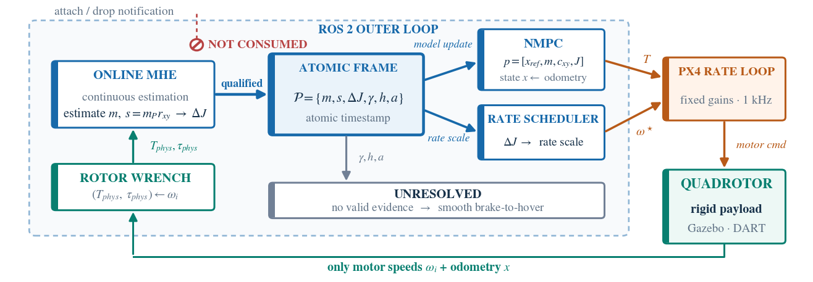
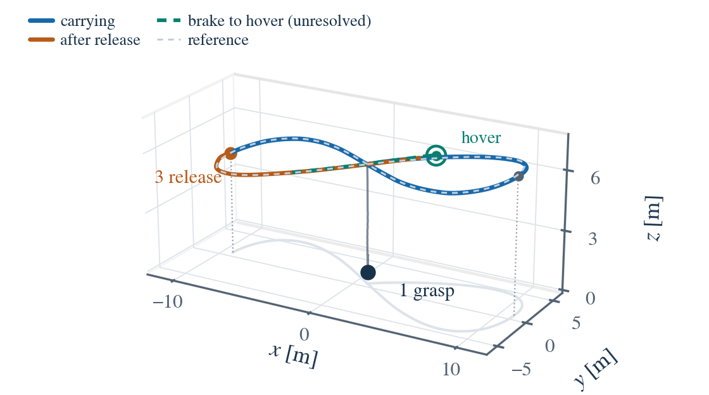
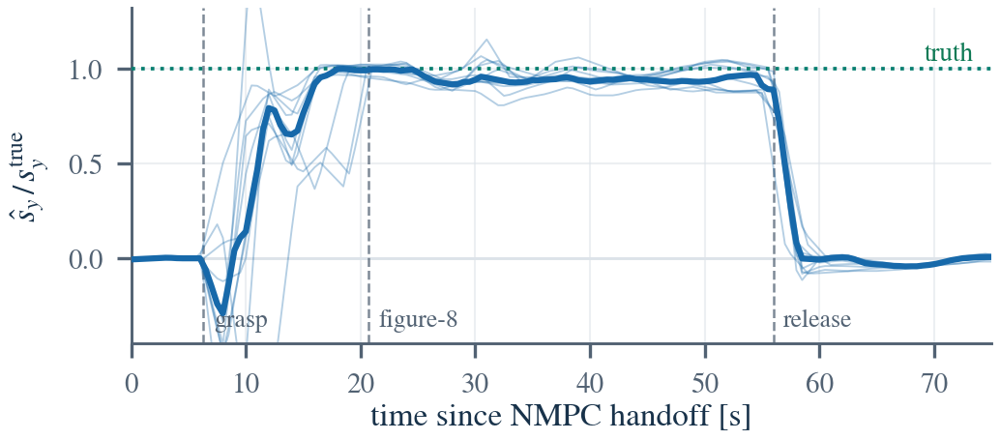
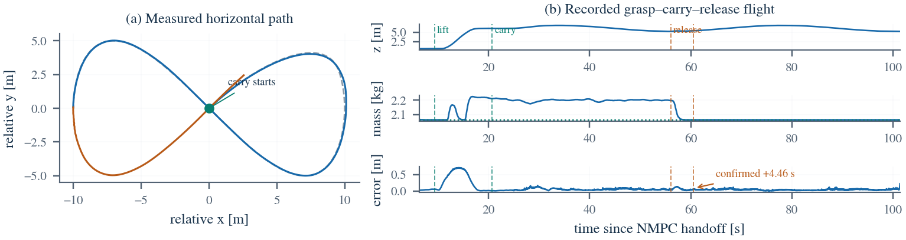

# 四旋翼无事件负载自适应 NMPC

> 中文审阅版（依据 `src/paper/main.tex` 当前投稿正文翻译，2026-09-15）。
> 本文件用于内容核对，不替代英文投稿源文件。公式编号、图表编号、实验数字及结论边界均与英文稿对应；参考文献引用键保留为 `[key]`，完整条目见 `refs.bib`。

作者：匿名作者（双盲评审）

## 摘要

释放指令并不能保证负载已经在物理上脱离；若控制器据此清除负载模型，就可能把带载飞行器当作空载飞行。本文提出一种用于四旋翼非线性模型预测控制（NMPC）的无事件负载模型接口，从不把挂载或释放指令作为证据。移动窗估计器（MHE）[rao2003] 根据里程计和不由负载估计计算得到的转子转速推力代理，估计组合体质量与水平一阶质量矩 $s=m_P r_{xy}$；与质心偏移不同，负载消失时 $s$ 仍具有良好定义。惯量增量由质量估计和较弱的竖直力臂先验得到，带健康门控和斜率限制的更新同时驱动 NMPC 模型与机体系角速度调度。在带有物理连接偏心负载的 PX4 [px4] 软件在环实验中（包括飞行器力矩极限处的 0.30 kg、4 m/s 压力测试），在负载真实挂载且飞行器存活至释放指令的 36 次飞行中，32 次完成释放确认；4 次失败均发生在 4 m/s，且均可追溯至估计器故障。机动中确认的延迟中位数为 3.46 s，制动至悬停后确认为 16.56 s。当真实脱离比指令晚 4 s 时，在收到指令时立即清模的基线于 5/5 次飞行中过早清模；无论是否由指令使能，持续确认机制都未提前清模。当控制器完全没有收到释放指令时，该接口仍在 18 次飞行中的 10 次检测到无信号负载丢失。上述结果仅适用于仿真及已测试条件。

## I. 引言

自主空中配送和飞行中空中操作会使多旋翼飞行器自身动力学发生突变。抓取或释放包裹会同时改变三个相互耦合的量：总质量 $m$（它改变推力到加速度的映射及悬停油门）、质心（推力不再通过组合体质心时会产生恒定配平力矩 $\tau\approx\Delta r\times f$；即使偏移很小，该力矩也可能很显著，因为 $f\approx mg$ 很大），以及转动惯量（它会减慢姿态响应，并有效降低内环带宽）。第一个通道属于外环位置/推力问题，后两个通道属于内环姿态/角速度问题。若控制器仅将负载建模为一个标量质量，便会产生跟踪误差；当负载足够重且存在偏心时，甚至可能失稳。

显式参数估计（用 EKF/MHE 估计质量、质心和惯量）具有可解释性，也能将估计量送入基于模型的约束，但面对突变时收敛较慢；集总扰动自适应（L1 自适应 NMPC、INDI）响应迅速，却不给出物理模型；基于学习的估计器通常需要丰富传感信息或真实值数据。本文有意选择显式估计路线并接受其延迟：所提接口以释放确认延迟为代价，换取绝不超前于物理证据的安全语义和具名物理参数。

本文的核心问题是：在不信任控制指令或外部提供的负载事件时，完整的“抓取—携带—释放”生命周期能否仍然自适应地更新其负载模型？我们的答案建立在两点观察上。第一，负载质量和一阶质量矩可以连续估计，惯量增量则由质量估计和较弱的几何先验通过代数关系得到；这一过程无需接收夹爪指令、挂载状态或外部事件通知。第二，在经过标定的转子推力模型下，转子转速遥测可提供并非由在线负载估计计算得到的总推力与机体系力矩代理；由此形成的残差不会经由控制器自身的指令继承质量估计误差。二者结合，使估计器无需外部事件信号，也无需测量水平挂载几何。

本文贡献如下：

1. 提出一种**一阶矩负载接口**。质量与水平一阶质量矩的联合估计采用刚体惯性参数的标准线性参数化 [atkeson1986]，使负载几何在释放过程中保持良好定义，而质心偏移在负载消失时不具备这一性质；同一个带健康门控的 $m/s/J$ 参数帧驱动有界的 NMPC 模型更新和连续机体系角速度调度（第 III–IV 节）。
2. 提出**不超前于证据的释放语义**：控制器只在估计器的无负载置信度持续满足条件后清除负载模型，绝不依据自身发出的释放指令；缺少证据时进入 UNRESOLVED 并制动至悬停（第 IV 节）。

本文在 PX4 SITL 中评估完整接口，报告每一次尝试、每次飞行采用的确认路径、配对的延迟脱离故障注入、无信号部分负载丢失，以及飞行器执行器极限处观察到的失败（第 VI-A 节和第 VII 节）。运行时估计器仅使用电机转速和里程计。唯一未在线辨识的几何量是较弱的竖直力臂先验 $r_z$；该量从推力—力矩通道在结构上不可观。

## II. 相关工作

**四旋翼敏捷飞行。** $\mathrm{SE}(3)$ 上的几何跟踪 [lee2010] 和时间最优飞行 [foehn2021] 都假定惯性参数已知且固定，而飞行中的负载事件会使这一假设失效。

**空中操作与运输。** 文献 [ollero2022] 综述了抓取、携带和释放物体等与环境发生物理交互的空中机器人；文献 [thomas2014] 展示了动态空中抓取，其中必须显式建模并控制夹爪动力学。文献 [villa2020] 综述了抓持式或绳索悬挂式负载运输。本文研究其中的运输与释放子问题：负载刚性连接于飞行器，因而必须处理飞行器自身质量、惯量和质心的变化。

**负载变化下的控制。** L1 自适应 NMPC [hanover2021]、INDI [smeur] 等自适应与鲁棒方法将负载视为集总扰动，是负载飞行的常用基线；尤其是 L1-NMPC 在未知负载和激烈轨迹下报告了明显的跟踪误差降低。另一类工作在 MPC 内以高斯过程拟合未建模气动效应 [torrente2021]，改善跟踪但同样不给出有名称的物理参数。悬吊负载控制 [sreenath2013] 显式处理摆动负载，并利用绳索悬挂系统的微分平坦性；刚性连接的负载则改变飞行器自身惯性参数。相关的本体感知方法利用基于动量的观测器直接估计外部力和力矩，以支持碰撞检测与交互控制 [tomic2017]。然而，外部力/力矩估计本身并不区分负载质量、质心偏移和转动惯量，因而不能直接用于更新依赖这些物理参数的推力裕度约束和内环增益调度。

**MHE 与在线参数估计。** 基于滤波和优化的估计器可恢复质量、惯量与几何参数 [svacha2020, wuest2019, bohm2021]，也已有工作估计空中操作中被抓取负载的质量与质心 [mellinger2011]。将质心写成一阶质量矩可使惯性参数线性地进入动力学，这是机械臂负载辨识中的标准方法 [atkeson1986]；本文采用它，是因为负载消失时该表示仍具有良好定义。标准 MHE 的性能对过程/测量权重矩阵非常敏感；神经 MHE（NeuroMHE）[neuromhe] 在线输出这些权重，解决偏差—方差权衡，但其估计对象是集总扰动力，而非显式命名的物理参数。

**基于残差的变化检测。** 基于残差的故障/变化检测（CUSUM 等 [basseville1993]）为负载生命周期状态机中的证据检查提供基础。本文不学习动力学，也不增加传感器；所有部署信号均来自电机转速和里程计。这有别于学习型 MPC [hewing] 和更广泛的安全学习框架 [brunke]——后者用学习模块吸收模型失配，而本文把失配分解为可供下游约束使用的具名参数。

## III. 系统概览与问题设置

**系统架构（图 1）。** 系统包含三层：Gazebo 物理环境（磁性 DetachableJoint 夹爪产生真实的惯量/质心变化）、PX4 内环角速度控制器，以及 ROS 2 外环（NMPC + MHE）。外环发布总推力和机体系角速度设定值，PX4 跟踪角速度。

> **图 1.** 系统架构与信息流。完整流水线只使用电机转速和里程计；一个原子化、带健康门控的 $m/s/J$ 参数帧同时驱动 NMPC 模型和连续角速度指令调度。该通路不接收任何挂载/投放通知。原图：`figs/fig1_architecture.pdf`。

**动力学与参数化。** NMPC 模型的运行时参数向量为

$$p=[x_{\mathrm{ref}},m,\Delta J,c_{xy}],$$

仅在 L1 基线中扩展集总扰动项。推力作用于几何中心、相对于组合体质心产生

$$\tau_{\mathrm{com}}=[-c_yT,+c_xT,0].$$

NMPC 求解

$$
\begin{aligned}
\min_{u_{0:N-1}}\;&\sum_{k=0}^{N-1}\left(\lVert e_k\rVert_Q^2+\lVert u_k-\bar u(p)\rVert_R^2\right)+\lVert e_N\rVert_{Q_N}^2\\
\mathrm{s.t.}\;&x_{k+1}=F(x_k,u_k,p),\quad x_0=\hat x,\quad u_k\in\mathcal U,
\end{aligned}\tag{1}
$$

其中，$x\in\mathbb R^{13}$ 包含位置、速度、姿态四元数和机体系角速度；$u=[T,\tau^{\mathsf T}]^{\mathsf T}$；$e_k$ 包含相对于参考的位置、速度、四元数向量部分和角速度误差；$F$ 为一步 RK4 离散化（$\Delta t=0.05$ s，$N=20$）。输入参考 $\bar u(p)=[mg,c_y mg,-c_x mg,0]^{\mathsf T}$ 是包含偏心配平力矩的实时悬停输入。$Q$ 和 $R$ 按 Bryson 规则设置，容差分别为 0.1 m、0.3 m/s、0.05、0.3 rad/s、2 N 及相应力矩上界；$Q_N$ 分别将 $Q$ 的位置、姿态和角速度块缩放 20、2 和 0.2 倍。执行器包络为 $T\in[1.27,31.35]$ N、$|\tau_x|,|\tau_y|\le0.5$ N·m、$|\tau_z|\le0.2$ N·m。

部署的 MHE 同时增广组合体质量和水平一阶质量矩：

$$
\begin{aligned}
x_{\mathrm{MHE}}&=\begin{bmatrix}x^{\mathsf T}&m&s_x&s_y\end{bmatrix}^{\mathsf T}\in\mathbb{R}^{16},\\
s&=m_Pr_{xy},
\end{aligned}\tag{2}
$$

并在每个窗口内令 $\dot m=0$、$\dot s=0$（$N=20$，$\Delta t=0.1$ s）。MHE 求解

$$
\begin{aligned}
\min_{x,w}\;&\lVert x_0-\bar x_0\rVert_{W_0}^2
+\sum_{j=0}^{N-1}\beta_j\left(\lVert y_j-Cx_j\rVert_{W_y}^2+\lVert w_j\rVert_{W_w}^2\right)\\
\mathrm{s.t.}\;&x_{j+1}=F_{\mathrm M}(x_j,u_j^{\mathrm{phys}})+Gw_j,\\
&m\in[0.95m_B,5\ \mathrm{kg}],\quad |s_x|,|s_y|\le1.5\ \mathrm{kg\,m},
\end{aligned}\tag{3}
$$

优化变量为 $x_{0:N}$ 和 $w_{0:N-1}$。其中，$y_j$ 为里程计，$C$ 选取 13 个飞行器状态；$u^{\mathrm{phys}}=[T_{\mathrm{phys}},\tau_{\mathrm{phys}}^{\mathsf T}]^{\mathsf T}$ 由下文所述的转子转速重构；$G=[I_{13},0]^{\mathsf T}$，因此不向 $m$ 和 $s$ 注入过程噪声。$W_y$ 取里程计噪声方差的倒数，对应噪声为 0.02 m、0.05 m/s、0.01 和 0.02 rad/s；$W_w=\mathrm{diag}(10^4I_6,10^5I_4,10^3I_3)$，有意给予动力学较高置信度。到达代价 $W_0=\mathrm{diag}(10^3I_6,10^4I_4,10^2I_3,0.1,100I_2)$ 以此前窗口平移后的解为中心，并且对 $m$（$\sigma\approx3.2$ kg）和 $s$（$\sigma=0.1$ kg·m）几乎不提供信息。

在报告的两个 4 m/s 条件中，$\beta_j\equiv1$。较早的残差触发调度会在从慢速基线自主检测到 4.4 N 的 $T_{\mathrm{phys}}$ 阶跃后，将阶跃前各阶段的权重缩放为 $10^{-4}$；该调度在 2 m/s 飞行中仍处于使能状态，但从未触发。由于抓取和释放瞬态都会越过其阈值，4 m/s 飞行中已将其关闭。$\beta_j$ 不接收任何外部事件。发布的几何量按下式重构：

$$
\begin{aligned}
c_{xy}&=\frac{s}{m},\\
\mu&=\frac{m_B\max\{m-m_B,0\}}{m},\\
\Delta J_{xx}&=\Delta J_{yy}=\mu r_z^2.
\end{aligned}\tag{4}
$$

其中 $r_z$ 是较弱的货架先验。部署接口忽略较小的 $O(r_{xy}^2)$ 对角项和偏航惯量增量。

**与估计值无关的推力代理。** 根据电机转速和机臂几何重构总推力 $T_{\mathrm{phys}}=k\sum_i\omega_i^2$ 与机体系力矩。二次系数 $k$ 是静态推力常数；在快速平移产生较大诱导来流时该关系会失准 [bangura2012]，本文未对此建模。若把 NMPC 的**指令推力**反馈给估计器，就会闭合估计器—控制器回路：该指令本身由 $\hat m$ 计算得到，其代价函数把 $T$ 锚定在 $\hat m g$ 附近；而指令与转子之间的逆映射误差、饱和或电机滞后对估计器均不可见。因此，质量误差可能以自洽方式持续存在，而不会表现为残差。转子转速代理位于这些环节的下游，并非由 $\hat m$ 计算得到；但它确实依赖经过标定的 $k$，且仿真器中的被控对象采用相同的平方律产生推力（第 VII 节）。

**推力到油门的逆映射。** 外环总推力指令通过电机模型 $T=k\omega^2$ 逆映射为归一化转子指令。只要正向推力重构和逆向指令映射使用一致的 $k$，稳态闭环跟踪通常不会直接受其绝对数值影响。

**连续内环调度。** 仅使 NMPC 模型一致并不能恢复 PX4 角速度环损失的带宽。因此，部署通路根据实时惯量增量缩放机体系角速度指令，对缩放量进行低通滤波，施加目标滞环和非对称上升/恢复斜率限制，并在最终饱和前保留 5% 指令裕度；它不会重写 PX4 参数。挂载时的“仅惯量”自举使用货架 0.30 kg 负载包络来提供即时安全性，在持续且一致的 MHE 证据出现后逐渐淡出。该自举既不注入负载质量，也不注入 $s$，投放通路仍完全依赖估计。

## IV. 在线估计与无事件自适应

### A. 连续负载接口与自主生命周期

MHE 发布一个原子参数帧：

$$
\mathcal P=\{m,s_x,s_y,c_x,c_y,\Delta J_{xx},\Delta J_{yy},\Delta J_{zz},J_{xx},J_{yy},J_{zz},\gamma,h,a\},\tag{5}
$$

其中 $\gamma$ 为无负载置信度，$h$ 为健康位，$a$ 为解的时间龄。健康状态要求最近一次求解成功，且里程计、电机转速和已知输入流均为新鲜数据。NMPC 还检查本地接收龄；参数帧不健康或过期时，冻结最后一次接受的模型并中断置信度持续计时器。有效帧在每次 NMPC 求解前经过低通滤波，并分别受质量、$s$ 和 $\Delta J$ 的斜率限制。

负载存在状态由估计器拥有，并有意与“已收到外部挂载通知”的旧标志区分。带滞环的 **EMPTY（空载）** $\leftrightarrow$ **LOADED（载荷）** 状态机使用持续的负载质量证据，并以有方向的残差作为快速通路；另一个锁存量记录本次飞行是否可靠进入过 LOADED。该锁存量可防止空载飞行时已有的置信度提前消耗之后的投放确认，也可防止八字机动中的短暂质量下降解除真实释放通路的就绪状态。

无负载置信度等于负载量、一阶矩和惯量三个连续“空载评分”的乘积。因此，即使质量估计触及下界，只要一阶矩非零，就会否决错误的空载判定。当释放证据被接受时，估计器只把 $s$ 的**发布目标**切换为零，而不覆写优化状态；因此输出滤波器产生连续衰减，而不是几何量阶跃。只有在健康置信度持续 1.0 s 高于 0.90 后，控制器才将计划投放标记为完成、复位 L1 状态并结束恢复；发送夹爪释放指令本身不会执行这些操作。

### B. 为什么一阶质量矩是必要状态

直接估计质心偏移在释放时是病态的：物理上 $s=m_Pr_{xy}\to0$，而当 $m_P\to0$ 时，$r_{xy}$ 本身没有定义。在早期仅估计质量的表述中，优化器只能把总质量压到空机质量以下，才能消除虚假的偏心；释放后的 55 个样本中有 14 个因此卡在下界。增广 $s$ 可直接提供转动通道，并在不知道随抓取而变的水平偏移时计算 $c_{xy}=s/m$。冻结窗口内的惯量系数可防止优化器把瞬时质量当作可任意调节的惯量旋钮，而较弱的 $r_z$ 先验保留主要的平行轴项。若不测量外部挂载几何，这是同时表示负载存在性、配平力矩和滚转/俯仰惯量所需的最小结构。

**估计器声明与控制器确认。** 控制器只有一条清除负载模型的路径：在健康、新鲜的参数帧上，$\gamma>0.90$ 持续 1.0 s，即完成确认。估计器还可以**声明**释放；该声明会把 $s$ 的发布目标切换为零，从而加快 $\gamma$ 上升，但声明既不是确认的必要条件，也不是充分条件。最终代码包含两条声明路线。

1. **一阶矩门控检测器**要求 $\rho=\lVert s\rVert/\lVert s\rVert_{\mathrm{ref}}$ 下降到 0.30 以下。载荷参考由健康、低动态、包络内的数据区间形成，并在激烈飞行前冻结。该检测器可在“负载量为空”与“一阶矩塌缩”证据共同持续 5 帧时触发（慢速通路），也可在一阶矩塌缩伴随持续的带符号推力残差阶跃时触发（一阶矩—残差通路）。释放检测器采用双窗口差分

$$\Delta T=\overline T_{\mathrm{post}}-\overline T_{\mathrm{pre}},$$

前后半窗均为 0.3 s。
2. **质量域路线**仅在低动态飞行中累计 $m_P<0.030$ kg 的证据，持续 20 帧后声明释放。

确认也可以在没有任何估计器声明的情况下发生；由于置信度的一阶矩评分使用 $\lVert s\rVert$ 的绝对界，非零一阶矩仍会否决确认。质量域路线和仅置信度确认都不使用冻结参考比值，因此经由它们得到的确认不构成对一阶矩门控检测器的证据；第 VI-A 节报告各路径的实际频次。一阶矩证据必须来自新鲜且成功的求解：连续 5 次求解失败后，重新锚定会把 $s$ 初始化为零，该值不计作塌缩。开发阶段还测试过“负载量—残差”分支，即以 0.9 N 残差配合“负载量为空”证据而不要求一阶矩证据；该分支因过早释放而被移除（第 VI-A 节）。一次记录到的八字飞行瞬态达到 $-1.69$ N，绝对值大于最小负载产生的 $-1.47$ N 阶跃，因此无法仅凭残差幅值区分二者。在线和离线评估调用同一个纯判定函数；UNRESOLVED 超时被视为未知，绝不视为空载证明。

表 1 列出负载生命周期阈值及其来源。所有阈值在最终实验批次开始前已经固定在代码中，没有根据该批次重新调参。只有 $\rho$ 和残差下限根据更早飞行的数据选定；其余数值属于尚未进行闭环敏感性扫描的工程选择。

**表 1. 负载生命周期阈值及其来源。“更早飞行”发生在本文报告的实验批次之前，且与该批次互不重叠。**

| 阈值 | 数值 | 来源 |
|---|---:|---|
| 一阶矩塌缩比值 $\rho$ | 0.30 | 对更早的 59 次飞行进行留一交叉验证；每一折均选择 0.30（0.20 在 59 次中成功 48 次） |
| 残差下限 / 持续帧数 | 0.9 N；2 或 4 帧 | 低于最小负载的 1.47 N 重量；在一次记录飞行中，超过 0.9 N 的八字机动瞬态至多持续 3 帧，而释放阶跃持续 4 帧 |
| 慢速通路持续帧数 | 5 帧（0.5 s） | 工程选择 |
| 质量域释放 | $m_P<0.030$ kg，持续 20 帧 | 位于更早 0.15 kg 飞行的带载最小值 0.079 kg 与释放后最大值 0.007 kg 之间 |
| 无负载置信度 | 高于 0.90 持续 1.0 s | 工程选择 |
| UNRESOLVED 超时 / 制动 | 12 s / 3 s | 工程选择 |

## V. 仿真设置

实验使用 PX4 SITL、Gazebo [gazebo]（Harmonic）、x500 四旋翼，以及能够产生真实惯量和质心变化的磁性 DetachableJoint 夹爪。

物理 DetachableJoint 夹爪连接一个独立刚体，因此会将质量、惯量和质心变化耦合起来，并支持本文保留的生命周期、基线和安全性结论。正文不再保留力/力矩模拟质量阶跃结果。

任务状态机为：接近（位置控制）$\rightarrow$ NMPC 交接并预热悬停 $\rightarrow$ 受控下降 $\rightarrow$ 启用主动抓取 $\rightarrow$ 提升 $\rightarrow$ 八字飞行 $\rightarrow$ 按相位触发释放。本文明确限定 NMPC 的作用范围：它控制抓取悬停和事件后的自适应阶段；接近控制器不属于本文贡献。批量实验采用无界面基础设施，并以 GCS 心跳替代程序运行。物理生效时刻 $t=0$ 定义为 $T_{\mathrm{phys}}$ 越过基线的时刻，进入误差带定义为 $\pm0.08$ kg 或阶跃幅值的 15%，取两者中较大者。

> **图 2.** 仿真器真实值给出的实测任务轨迹，展示同一批次中两次 0.15 kg、2 m/s 的飞行：抓取（1）、提升，随后沿具有 $\pm0.8$ m 竖直起伏的八字轨迹（蓝色）跟踪标称参考（浅色虚线）。释放指令（3）后，一次飞行在机动中通过一阶矩投票并继续跟踪（橙色）；另一次在 12 s 超时处声明 UNRESOLVED，继而制动至悬停（青色），并于 16.40 s 完成确认。超时前两条路径的中位差不超过 0.12 m；载荷阶段跟踪 RMS 为 0.053 m，释放后为 0.060 m。原图：`figs/fig_track_3d_measured.pdf`。

**实时计算预算。** 两个优化器均为 acados [acados] SQP 求解器，使用 merit 回溯和 HPIPM [hpipm] QP 求解器。在一颗与 Gazebo/PX4 SITL 共享的桌面 CPU 核心上，部署的 13 状态 NMPC（$N=20$，20 Hz）求解时间中位数为 1.3 ms，99 分位数为 2.2 ms（$n=1009$），分别占 50 ms 周期的 2.6% 和 4.4%。部署的 16 状态一阶矩 MHE（$N=20$，10 Hz）求解时间中位数为 9.2 ms，90 分位数为 24.6 ms，99 分位数为 59.2 ms，最大值为 72.8 ms（$n=3740$，每次飞行丢弃前 20 帧），而周期为 100 ms；其中位数约为历史 14 状态仅质量估计器（1.4 ms）的 7 倍。仿真中满足截止时间，但尾部裕度较窄，因此本文**不声称**机载计算余量充足；必须在目标计算机上实测。系统以 50 Hz 对最新预测插值并发布设定值。

## VI. 结果

**数据来源说明。** 生命周期实验使用最终的 16 状态一阶矩接口；其中两个 4 m/s 条件是在关闭残差触发调度后重新飞行的，且所有生命周期飞行均早于第 VII 节所述的基于窗口的重新初始化种子。基线矩阵使用较早的 14 状态仅质量 MHE，只支持下文明确限定的基线比较。

在表 5 中，“truth”表示 NMPC 获得仿真中测得的挂载几何；“online”表示以由电机力矩反演得到的估计值取代质心偏移；“l1”是 L1 自适应基线。该矩阵只能支持下文明确限定的基线比较，不能用于评估本文提出的一阶矩接口。

> **图 3.** 一阶质量矩与真实值的比较（0.15 kg、2 m/s，$n=11$，各自以对应真实值归一化）。真实值由仿真器测得的抓取偏移按 $m_P r_y$ 离线重构，绝不送入估计器；估计器运行时不知道水平挂载几何。$\hat s_y$ 在抓取前为零，不依赖挂载通知而随抓取上升，在八字飞行期间保持在真实值附近，并在释放后衰减至零。在原始实验批次的 31 次符合条件飞行中，携带阶段估计偏向于零（斜率 0.85；幅值低估中位数 10.8%，31/31 方向一致；0.30 kg 条件下最大，中位数 15.7%）。该偏差的原因尚未确定；一阶矩门控检测器使用比值 $\lVert s\rVert/\lVert s\rVert_{\mathrm{ref}}$，因而不受共同尺度偏差影响。原图：`figs/fig_moment_truth.pdf`。

### A. 无事件“抓取—释放”生命周期

> **图 4.** 最终批次的一次无事件飞行（0.15 kg、2 m/s）。左：实测水平轨迹，其中蓝色表示携带阶段、橙色表示释放后阶段；灰色虚线为包含幅值渐增段的标称参考。右：从抓取、提升、携带、释放指令到确认期间记录的高度、控制器采用的质量估计和位置误差范数。该次飞行在机动过程中完成确认，发生于指令后 4.46 s；它只展示一次执行，不能替代表 3 的总体统计。原图：`figs/fig_mission.pdf`。

控制器自身发出夹爪释放指令，但不依据该指令清除负载模型。本文报告负载确实完成物理挂载（以夹爪的挂载记录为准）且飞行器存活至释放指令的全部无事件飞行。预注册规则原本以 MHE 质量证据判定挂载，因此会静默排除估计器未识别到已挂载负载的飞行。

#### 配对指令触发基线

本文保留预注册的配对设计，而不是在比较后只选择 B。A 是旧接口上的指令触发基线：它把释放指令视为脱离事件，并立即复位负载几何和内环缩放；B 是本文提出的接口。两者在释放前也有差异：A 使用旧的非连续几何通路，并通过重写 PX4 角速度增益调度内环；B 使用连续的 $m/s/J$ 参数帧和机体系角速度指令缩放。只有双方均符合条件的实验对才进入比较。共 19 对，三个条件分别为 8/3/8 对；两者均完成 19/19 次释放，且未观察到释放后失稳（表 2）。A 的确认延迟按定义为零。0.30 kg、4 m/s 条件仅形成 3 对，因为 A 在该条件的 16 次尝试中有 11 次在提升期间或刚提升后坠毁（第 VII 节）。

**表 2. 配对指令触发消融。** A 按构造在释放指令时清除模型；B 要求估计器证据；C 与 B 其余部分相同，但释放证据仅由指令使能。最后两行注入指令与真实脱离不一致的故障；“提前清模”指 DetachableJoint 被移除前已清除模型（“—”表示不评分）。A/B 保持实验另有一次有效但未配对的 B 运行，也没有提前清模。

| 条件 | 有效配对 | A 完成 | B 完成 | 提前清模 A/B |
|---|---:|---:|---:|---:|
| 0.15 kg，4 m/s | 8 | 8/8 | 8/8 | — |
| 0.30 kg，4 m/s | 3 | 3/3 | 3/3 | — |
| 0.15 kg，2 m/s | 8 | 8/8 | 8/8 | — |
| 名义条件合并 | 19 | 19/19 | 19/19 | — |
| 0.15 kg，2 m/s + 4 s 物理保持 | 5 | 5/5 | 5/5 | 5/5 / 0/5 |
| 同上，以 C 代替 A | 6 | 6/6（C） | 6/6 | 0/6 / 0/6 |

在延迟脱离条件下，指令触发基线按设计会过早清模；该实验测量这种时序不一致，以及基于证据更新所付出的确认延迟。故障注入器收到正常释放指令后继续保持真实 DetachableJoint，中位保持时间为 4.01 s。12 个单臂运行中，一次 A 未能解锁 PX4，留下 5 个有效配对和 1 次有效但未配对的 B 运行。在全部 5 个配对中，A 均在指令时刻清模，比真实脱离早 4.01 s（中位数）。B 的 6 次有效运行均未在真实脱离前清模：其中 5/6 进入 UNRESOLVED，随后在真实脱离后 12.45 s（中位数）确认；另一次在脱离后 3.00 s 确认。全部 11 次有效运行均有独立的 Gazebo DETACHED 记录。保持期间位置误差峰值中位数为 A 0.071 m、B 0.068 m，因此该结果支持模型—被控对象一致性的差异，而非跟踪优势或避免坠毁。本文未测试夹爪永久卡死；在该情形下，A 会以空载模型控制仍带载的飞行器。

#### 指令使能确认与无信号丢失

保持实验验证的是持续确认，而不是无事件性：仅由指令使能的变体 C（其余与 B 相同，在推力下降持续 3 s 后确认）也从未提前清模（0/6 对），且在真实脱离后确认得更快，中位数为 4.3 s，而 B 为 7.3 s。无事件性的重要性体现在控制器没有收到释放指令时，例如夹爪自行打开、负载被扯落，或其他模块触发释放但通知丢失。在释放阶段注入这类丢失后，B 在 18 个配对中的 10 个检测到负载丢失：2 m/s 为 4/9，0.15 kg、4 m/s 为 4/5，0.30 kg、4 m/s 为 2/4；延迟中位数为 2.2–2.9 s。C 因从未被使能而 0 次检出，并保留虚假的一阶矩。8 次漏检中有 7 次是因为丢失前载荷一阶矩参考尚未形成，或负载尚未被识别。持续暴露于带载飞行的检测器存在误报代价，但实验中未观察到：209 次带载飞行（3.7 h）中，没有在指令或注入丢失前声明释放；按飞行计的 95% 上界为 1.4%。

#### 完整接口的完成率与延迟

完整接口在 36 次符合条件的飞行中有 32 次完成释放确认（表 3；双侧 95% Clopper–Pearson 区间为 [73.9%, 96.9%]）。4 次失败均发生在 4 m/s，且均可追溯至估计器故障（第 VII 节）：3 次始终未识别负载并保持 UNRESOLVED，另 1 次在释放后发散。预注册规则会排除前 3 次，得到 31/32。该结果是针对完整接口的有条件闭环结果，并非对某一个释放检测器的验证；表 4 表明，实际出现了三种确认路径。

确认延迟呈**双峰**。32 次已完成飞行中有 17 次在飞行器仍执行八字轨迹时越过置信度阈值，确认延迟中位数为 3.46 s（图 4）。其余 15 次在机动中没有可用的释放证据——$\hat s$ 在持续激励下漂移，或冻结参考始终未形成——因此到达 12 s 超时、声明 UNRESOLVED，并用 3 s 平滑制动至悬停；确认随后在中位 16.56 s 完成。表 3 将两条控制路径分开报告。

**表 3. 释放完成情况及确认延迟（全部符合条件的 B 飞行）。** 延迟从释放指令起算，到 1.0 s 置信度保持结束，并仅对已完成飞行计算。两个延迟列对应不同的控制通路，不合并统计。

| 条件 | $n$ | 完成 | 机动中确认延迟，中位数 [IQR] | 制动至悬停后确认延迟，中位数 [IQR] |
|---|---:|---:|---:|---:|
| 0.15 kg，4 m/s | 11 | 10/11 | 2.90 s [2.90, 2.90] | 16.60 s [16.60, 16.60] |
| 0.30 kg，4 m/s | 13 | 10/13 | 8.95 s [8.00, 9.26] | 16.40 s [16.20, 16.70] |
| 0.15 kg，2 m/s | 12 | 12/12 | 3.31 s [2.95, 4.36] | 16.48 s [16.40, 16.50] |
| 合并 | 36 | 32/36 | 3.46 s [2.90, 8.00] | 16.56 s [16.46, 16.60] |

总体最大延迟为 16.70 s。仅在制动至悬停后才确认的比例，按三个条件依次占已完成飞行的 50%、40% 和 50%，合并为 47%。

**表 4. 表 3 所列 32 次已完成飞行的确认路径。** 每次确认都使用控制器的置信度路线（第 IV 节）；各列记录估计器是否以及如何作出声明。“一阶矩门控”表示检测器先于置信度越阈声明；“质量域”表示冻结参考从未形成，置信度在制动至悬停期间或之后不久越阈，而质量域路线在 0.9–3.1 s 后才声明；“仅置信度”表示参考未形成且估计器从未声明（全部发生在机动中）。

| 条件 | $n$ | 一阶矩门控 | 质量域 | 仅置信度 |
|---|---:|---:|---:|---:|
| 0.15 kg，4 m/s | 10 | 9 | 1 | 0 |
| 0.30 kg，4 m/s | 10 | 1 | 3 | 6 |
| 0.15 kg，2 m/s | 12 | 9 | 0 | 3 |
| 合并 | 32 | 19 | 4 | 9 |

任何路径都没有在释放指令前声明释放。32 次已完成飞行中有 23 次的负载存在状态机恰好转换两次：抓取时一次、释放时一次；在 9 次仅置信度飞行中，估计器在确认后超过 40 s 的日志窗口内始终没有声明 EMPTY。所有载荷声明均来自持续质量证据；系统未接收外部抓取信号。发布的一阶矩连续衰减，而非阶跃至零（图 3）。

#### 部分负载丢失

系统同时抓取 4 个 0.05 kg 箱体，并在抓取后 45、80 和 115 s 依次无信号、无释放指令地脱离其中 3 个；对照方案携带相同箱体但不丢失负载，每个速度包含 5 个交替的有效配对。预注册判据为：（a）$\hat m$ 在至少 80% 的阶跃后进入新真实值的 $\pm0.02$ kg 范围；（b）配对跟踪 RMS 差不超过 0.02 m，且不坠毁；（c）前两次丢失后不声明 EMPTY。在 2 m/s 下全部判据均通过：$\hat m$ 跟踪了 15 次阶跃中的 14 次，收敛时间中位数范围为 1.1–8.8 s；没有错误 EMPTY 声明，跟踪与对照方案不可区分。在 4 m/s 下，判据（a）仅达到阈值（12/15），因此本文只对 2 m/s 下的恢复作出主张。

#### 开发阶段证据

两项较早测试推动了最终设计，但使用的是早期代码，不能验证最终检测器。不含一阶矩证据的“负载量—残差”快速分支，在 4 m/s 八字机动的 9 次随机飞行中有 3 次过早声明释放。移除该分支后，在冻结参考尚未引入前，对一阶矩门控检测器进行 12 次随机飞行测试：没有指令前声明，11 次通过一阶矩门控路线释放（检测延迟中位数 1.9 s），另一次保持 UNRESOLVED。

#### 尝试与排除

配对实验共包含 84 次尝试。B（所提方案）共 42 次：36 次符合条件，5 次在释放指令前坠毁（0.30 kg、4 m/s 八字机动中 3 次，2 m/s 提升阶段 2 次），另 1 次没有发生物理挂载。A 共 42 次：25 次符合条件，17 次在释放前坠毁，其中 11 次发生在 0.30 kg、4 m/s 条件的提升期间或刚提升后。由于两种方案在释放前已经存在差异，本文按方案分别报告这些比率，不合并也不作比较；它们均不代表端到端任务可靠性。表 2 使用双方均符合条件的 19 对，表 3 使用全部 36 次符合条件的 B 飞行，表 4 使用其中完成确认的 32 次。本文不比较尾窗跟踪，因为 B 在 UNRESOLVED 超时后制动至悬停，而 A 继续执行八字轨迹。

### B. 基线与消融

**L1-NMPC 三方法矩阵（表 5）。** 实验矩阵为 {truth, online, l1} $\times$ {0.2, 0.3} kg $\times$ {0.05, 0.10} m，每个单元 $n=5$，60/60 次运行均稳定，无发散。

1. 各单元的瞬态峰值在 0.05 m 内一致。L1 在两个低偏心距单元中较高（未经多重校正的 $p=.008$、$.012$，在对 8 次检验进行校正后不再显著），因此本文不声称具有瞬态优势。
2. 相对于部署的 **online** 估计，**L1 的恢复慢 8%–32%**（中位数 16%，4 个单元中有 3 个达到显著）。原因是其补偿低通截止频率 $\omega_c$ 受闭环稳定性限制：本平台上 0.5 稳定而 1.0 不稳定。显式参数估计不受这一带宽壁垒限制。
3. L1 不产生可解释的 $m/c_{xy}$，且仍需同类先验进行增益缩放。本文实现的是由 $T_{\mathrm{phys}}$ 驱动的三自由度平动增广；若改用指令推力则会产生自激。0.3 kg / 0.10 m 单元中 truth 的瞬态峰值较大，其原因尚未解释；参数更准确并不必然减小瞬态峰值。三种方案均使用较早的仅质量 MHE。

**表 5. 三方法 × 场景矩阵（$n=5$）：位置误差峰值 [m] / 恢复时间 [s]。**

| 工况（质量 / 偏心距） | truth | online | l1 |
|---|---:|---:|---:|
| 0.2 / 0.05 | 0.806 / 4.28 | 0.768 / 3.70 | 0.821 / 4.26 |
| 0.2 / 0.10 | 0.794 / 3.62 | 0.810 / 3.92 | 0.812 / 4.24 |
| 0.3 / 0.05 | 0.834 / 3.56 | 0.837 / 3.72 | 0.883 / 4.90 |
| 0.3 / 0.10 | 1.011 / 3.64 | 0.876 / 3.88 | 0.891 / 4.54 |

## VII. 局限性与未来工作

目前全部系统级证据都仅来自 SITL。迁移到硬件时，需要以 ESC 遥测替代仿真电机转速，并在自由飞行前重新辨识推力/力矩系数、噪声底、时序和夹爪柔顺性。

**推力代理。** 仿真中，被控对象与估计器使用相同的平方律 $k\omega^2$，且电机转速没有测量误差。仅将估计器的推力映射缩放 $\pm5\%$（0.15 kg、2 m/s，每个方向 4 次飞行）没有导致指令前释放，但两个方向都使接口失效：缩放为 0.95 时，4/4 次均未识别负载；缩放为 1.05 时，释放后有 3/4 次持续保留虚假的 0.09 kg 负载并进入 UNRESOLVED。因此，$k$ 的标定误差必须显著小于 5%；转速噪声、延迟和诱导来流 [bangura2012] 仍未测试。

**缺失的基线。** 本文尚未比较固定参数 NMPC、在相同信号和匹配误报约束下的 CUSUM 检测器 [basseville1993]，以及采用最终估计器的 L1-NMPC。竖直力臂 $r_z$ 无法从推力—力矩通道观测，因此仍是较弱的先验；$s_x$/俯仰通道的噪声大于 $s_y$/滚转通道。部署的对角惯量近似还忽略了较小的 $O(r_{xy}^2)$ 项和偏航惯量项。

**释放检测器的结论边界。** 开发阶段测试和最终批次的三条确认路径已在第 VI-A 节报告；32/36 次完成并不能建立分布范围内的普遍鲁棒性。32 次已完成飞行中有 13 次在 LOADED 声明后始终没有填满健康、低动态、包络内的参考窗口，因此一阶矩比值检验从未运行。包络外的 $\hat s$ 样本不参与一阶矩投票，但仍通过滤波和斜率限制进入控制器的 $c_{xy}$。包络假设抓取偏移不超过 0.13 m，而夹爪实际允许 0.15 m；这影响了 13 次 0.30 kg 飞行中的 2 次，不能解释大多数参考缺失案例。因此，要得到鲁棒的自主释放检测器，仍必须可靠地形成参考。

全部已报告的释放批次都显式启用了释放证据通路。其内置默认状态为关闭，此时每次飞行最终都会进入 UNRESOLVED；因此部署时必须显式启用该通路，并在启动时验证配置。

**一阶矩漂移。** 持续八字激励会使 $\lVert\hat s\rVert$ 从 0.012 kg·m 增大到 0.031 kg·m；此时禁止一阶矩证据会推迟确认。在受影响的试飞中，减速后 3.3–3.4 s 即恢复投票。该现象与参考缺失共同造成表 3 中“制动至悬停”通路的延迟。在线一阶矩包络超限计数在 4 m/s 下与这一结果相关：零超限时 9/10 次在机动中确认，否则仅 2/10 次；Fisher 检验 $p=0.006$。但它漏掉了全部 6 次 2 m/s 延迟案例。更早退出机动尚未实现，仍需验证。

**工作极限。** 0.30 kg、4 m/s 是飞行器执行器极限处的压力测试，而不是工作点。悬停需要最大推力的 74%，但真正受限的是力矩：八字机动中，俯仰力矩在 98% 的 5 s 诊断窗口内饱和，偏航力矩为 53%；相比之下，0.15 kg、4 m/s 分别为 46%/16%，2 m/s 时均不超过 6%。机体系角速度缩放中位数达到 4.39，接近 5.0 上限。B 的 5 次释放前坠毁中有 3 次（八字机动发散）以及 4 次未完成释放中的 3 次发生于此；旧方案 A 在 16 次尝试中有 11 次在提升期间或刚提升后坠毁，因为箱体仍在地面时，其角速度缩放从质量估计下界开始。所有符合条件的 2 m/s 飞行都完成释放确认。本文在该极限处主张的是安全释放语义，而非可靠飞行；部署需要保留力矩裕度。

**估计器故障。** 4 次飞行中的发布质量始终没有离开空载值；其中 2 次是连续求解失败后以质量下界种子重新初始化。发生在 4 m/s 的 3 次飞行没有发散，但保持 UNRESOLVED。另一次 0.30 kg 飞行在释放前有 48 s 的估计不健康；由于按相位触发的释放指令没有以估计器健康状态门控，脱离后冻结模型不再匹配飞行器并最终发散。系统现在使用窗口竖直力平衡为重新初始化提供种子；在该条件下预注册 A/B 比较使八字阶段重新初始化次数从 29 降至 1。不过，本文报告的批次早于该修改，以估计器健康状态门控释放仍是待解决问题。

持续的竖直上升气流或下降气流，在仅使用总推力残差时仍与负载变化存在固有混淆；本文报告的飞行批次没有评估风扰动。

**仿真器保真度。**

1. gz-sim Harmonic 无法以物理引擎实际采用的方式在运行时改变连杆惯量（问题 #2733），因此所有负载变化均由 DetachableJoint 平台连接独立刚体实现。
2. 负载按刚性连接建模，未建模夹爪柔顺性和摆动模态。这两点均不影响估计器所使用的信号种类。

## VIII. 结论

本文提出了一种用于四旋翼 NMPC 的无事件负载模型接口：它根据里程计和转子转速推力代理估计组合体质量与水平一阶质量矩，并且只在估计器证据持续满足条件后清除负载模型，绝不依据自身发出的释放指令。在 PX4 SITL 中，完整接口通过三种确认路径，在 36 次符合条件的飞行中有 32 次完成释放确认；机动中确认的延迟中位数为 3.46 s，制动至悬停后确认为 16.56 s。4 次失败均来自 4 m/s 下的估计器故障，其中 3 次发生在飞行器力矩极限处。面对 4 s 延迟脱离，无论是否由指令使能，持续确认都避免了指令触发基线在 5/5 次飞行中的提前清模；此外，无事件接口检测到 18 次无信号负载丢失中的 10 次，而仅由指令使能的确认器无法发现这类事件。硬件验证、推力映射失配、可靠的一阶矩参考形成、以估计器健康状态门控释放以及更强的基线比较仍有待完成。

## 参考文献

参考文献条目及引用顺序与英文投稿稿一致，见 `refs.bib` 和编译生成的 `main.bbl`。本中文审阅版不重复翻译论文题名，以免改变可检索信息。
